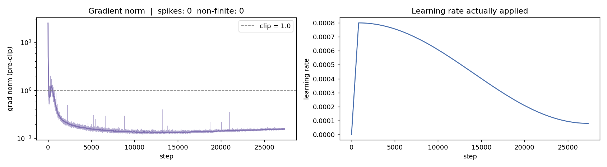

# Task 1 - Pratiksha Kaushik

A GPT-style character-level language model, written from scratch and trained on TinyStories. Code, logs, outputs and all metrics are in [task1_llm/Pratiksha_Kaushik](../../task1_llm/Pratiksha_Kaushik/README.md). The final notebook is [Task1_gpt.ipynb](../../task1_llm/Pratiksha_Kaushik/src/Task1_gpt.ipynb).

Run: `20261005-223946_L8H8C512T512`. Hardware: NVIDIA A100-SXM4-40GB (Colab), PyTorch 2.11.0+cu130, Python 3.13.15, bf16 autocast with `torch.compile`.

## Experiment

**Data.** I used `roneneldan/TinyStories` from Hugging Face. I made my own split with seed 1337: **100,000 training stories and 10,000 validation stories**, taken from the train partition. Text was repaired with ftfy, curly quotes and dashes were mapped to ASCII, stories under 50 characters were dropped, and duplicates were removed before splitting, so no story is in both sets. The split indices are saved in `data_processed/split_indices.json`.

**Tokenization.** Character-level. I built `char_to_idx` / `idx_to_char` from the training split: every character seen at least 20 times (78 characters), plus `<|eos|>` between stories and `<unk>`, for **80 symbols** in total. They cover 99.9999% of training characters. Training text: 89.66M characters; validation: 8.99M.

**Sequences.** The encoded text is cut into fixed-length input/target windows of 512 characters, with the target shifted one character to the right. That gives 175,109 windows per epoch. The window offset changes randomly each epoch, so every character is seen once per epoch but the boundaries move.

**Model.** Every component is written from tensor operations. No `nn.Transformer`, `nn.MultiheadAttention` or `scaled_dot_product_attention` is used.

| Component | Setting | Parameters |
|---|---|---|
| Token embedding | learned, 80 × 512 | 40,960 |
| Positional embedding | learned absolute, 512 × 512 | 262,144 |
| 8 Transformer blocks | pre-LayerNorm → causal multi-head self-attention → residual; LayerNorm → feed-forward → residual | 25,219,072 |
| Multi-head self-attention | 8 heads × 64 dims, fused QKV projection, lower-triangular causal mask, fp32 softmax | (in blocks) |
| Feed-forward network | 512 → 2048 → 512, GELU | (in blocks) |
| Final LayerNorm | 512 | 1,024 |
| Language-model head | linear 512 → 80, untied | 40,960 |
| **Total** | | **25,564,160** |

Two checks confirm the causal mask: the attention weights above the diagonal are exactly zero, and changing future tokens leaves earlier logits unchanged. The initial loss was 4.53, close to ln(80) = 4.38, as expected for a correctly initialised model.

**Training.**
- **Objective:** cross-entropy loss, batch 64 × 512 = 32,768 characters per step.
- **Length:** 10 epochs, 27,360 steps, 896.5M characters seen.
- **Optimizer:** AdamW (β = 0.9, 0.95; weight decay 0.1 on weight matrices only) with gradient clipping at 1.0 and dropout 0.1.
- **Learning-rate schedule:** linear warm-up for 820 steps (3%) to a peak of 8e-4, then cosine decay to 8e-5. The plot is in `outputs/plots/lr_schedule.png`.

**Why this size.** A pilot model (6 layers, 384-d, context 256) ended at validation CE 0.544. Its train/val gap was only 0.016 and its loss was still falling, which means it was limited by capacity rather than overfitting. The final model adds depth, width and a longer context. The pilot notebook is `src/Task1_gpt_pilot_L6H6C384T256.ipynb`.

## Results

| Metric | Value |
|---|---|
| Training cross-entropy | 0.4476 nats/char |
| Validation cross-entropy | **0.4742** nats/char |
| Perplexity (val / train) | **1.607** / 1.565 |
| Bits per character (val / train) | **0.684** / 0.646 |
| Generalization gap | +0.0266 nats/char (+5.95%) |
| Top-1 next-character accuracy (val / train) | **84.74%** / 85.44% |

The best checkpoint is from epoch 10, which is also the last epoch: validation loss improved every epoch.


**Per epoch**

| Epoch | Train CE | Val CE | Gap | Val perplexity | Val bits/char | Val top-1 |
|---|---|---|---|---|---|---|
| 1 | 0.6337 | 0.6369 | +0.0032 | 1.891 | 0.9189 | 79.72% |
| 2 | 0.5690 | 0.5766 | +0.0076 | 1.780 | 0.8319 | 81.55% |
| 4 | 0.5142 | 0.5292 | +0.0151 | 1.698 | 0.7635 | 83.04% |
| 6 | 0.4832 | 0.5016 | +0.0184 | 1.651 | 0.7236 | 83.89% |
| 8 | 0.4596 | 0.4825 | +0.0229 | 1.620 | 0.6961 | 84.46% |
| 10 | 0.4470 | 0.4742 | +0.0272 | 1.607 | 0.6841 | 84.74% |

All 10 epochs are in `outputs/metrics/epoch_metrics.csv`.

**Accuracy by type of character (validation)**

| Target | Share of targets | Top-1 accuracy |
|---|---|---|
| First letter of a word | 19.6% | 56.33% |
| Inside a word | 56.4% | 92.03% |
| Space / punctuation | 24.0% | 90.52% |

**Generation diversity** (all sets truncated to the same 2,257 words)

| Source | Distinct-1 | Distinct-2 | Distinct-3 | Repeated 4-gram rate |
|---|---|---|---|---|
| Model, temperature 0.8 | 0.2118 | 0.6546 | 0.8688 | 1.35% |
| Model, greedy | 0.1254 | 0.3788 | 0.5043 | 5.92% |
| Real validation stories | 0.2428 | 0.7230 | 0.9183 | 1.09% |

**Stability and efficiency**

| Metric | Value |
|---|---|
| Gradient norm after warm-up, median / p99 / max | 0.145 / 0.341 (after warm-up); max 25.5 over all steps |
| Steps clipped at 1.0 | 1.06%, almost all during warm-up |
| Loss spikes (loss > 1.3 × moving average) | 0 |
| NaN / Inf steps | 0 |
| Parameters | 25,564,160 |
| Training throughput | 452,013 characters/s |
| Generation throughput | 96 characters/s (batch 1), 2,182 characters/s (batch 32) |
| Peak GPU memory | 10.59 GiB allocated (10.79 GiB reserved) |
| Total training time | 36.9 min, 10 epochs including evaluation |



## Generated text

Temperature 0.8, prompt "Once upon a time":

```text
Once upon a time, there was a soft dog named Spot. Spot loved to run and play with his friends. One day, they were playing outside when they saw a big, mean truck driving by. The truck was loading water on the dog's fence. Spot was very scared and also wanted to run away.

Spot ran inside the truck and started to chase his friends. They ran and ran, but the truck was too fast. Spot was getting tired and did not want to stop. So, he sat on the fence and closed his eyes.
```

Greedy decoding, temperatures 0.5 / 0.8 / 1.0 (top-k 20) / 1.3, and unconditional samples are in `outputs/samples/`.

## Failure analysis

Each case was chosen by a measurable rule (highest repeated 4-gram rate, highest invented-word rate, lowest overlap between the first and second half of a story), not picked by hand. The full write-up is in [failure_analysis.md](../../task1_llm/Pratiksha_Kaushik/failure_analysis.md).

**Case 1 - Repetition (greedy decoding)**

```text
The sun was hot and the birds were singing. The birds were singing and the sun was shining. The birds were singing and the sun was shining.
```

Repeated 4-gram rate 86.6%, against 1.1% in real stories. Greedy decoding always takes the single most likely character, so once a common phrase is produced, the same context comes back and the model loops. Each step is a reasonable prediction; the problem is the decoding method.

**Case 2 - Broken grammar / invented words (temperature 1.3)**

```text
Peter was svery exhausted, but they decided to keep going. It seemed like someday it fit up heavily in her green home.
```

Invented-word rate 4.0%, against 0.03% at temperature 0.8 ("svery", "originalt", "aira"). A high temperature moves probability into unlikely characters in the middle of words. Because the model spells one character at a time, one bad sample creates a non-word, and the unfamiliar context then makes the next errors more likely.

**Case 3 - Loss of coherence (temperature 0.8, 1,533 characters)**

```text
Tom and his dog went to the park. They saw many things: trees, flowers, birds, dogs. [...]
And you have to say sorry to the sandbox. I will keep the sand away."
```

Only 7.4% of content words are shared between the first and second half, and the names from the opening (Lily, Tom) are gone by the end. Each sentence is fluent, but the model only sees the last 512 characters (about 100 words), so the start of the story drops out of its context and the plot drifts.

## Strengths, weaknesses and limitations

**Strengths:**
- The full GPT architecture is built from scratch, with two tests confirming the causal mask.
- Training is stable: 0 loss spikes and 0 NaN steps.
- The generalization gap is small (+0.027 nats/char), so the model isn't memorising stories.
- With temperature 0.8, text diversity is close to real stories (distinct-3 0.869 vs 0.918) and spelling is almost perfect (0.03% invented words).

**Weaknesses and limitations:**
- **Context window.** 512 characters is only about a third of an average story, so long stories lose coherence (Case 3).
- **Character-level cost.** Most uncertainty is at the start of each word (56% accuracy, against 92% inside words), and generating text is slow without a KV-cache (96 characters/s for a single stream).
- **Greedy decoding loops** (Case 1 at the extreme, 5.9% repeated 4-grams overall), so sampling with a temperature is needed.
- **Single run.** One seed and one model size; the loss was still falling slightly at epoch 10.
- **Raw log.** The log file written during the run stopped after setup. The full log was recovered from the notebook's printed output, as explained in the task README.

## Future improvements

1. Add a KV-cache so generation reuses earlier attention results. This should give a large speed-up for long samples.
2. Use a longer context (1,024+) or a subword tokenizer, so a whole story fits in the window and coherence improves.
3. Add a repetition penalty or nucleus (top-p) sampling, and measure the repeated 4-gram rate again.
4. Train for a few more epochs, or with a larger model. Validation loss was still improving by 0.0024 per epoch at the end.
5. Run 2-3 seeds and report the mean and standard deviation of validation CE.
