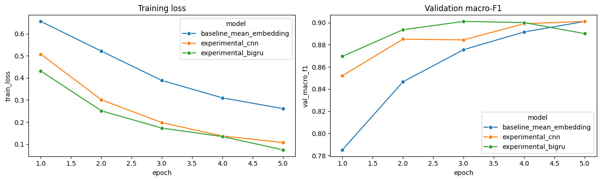
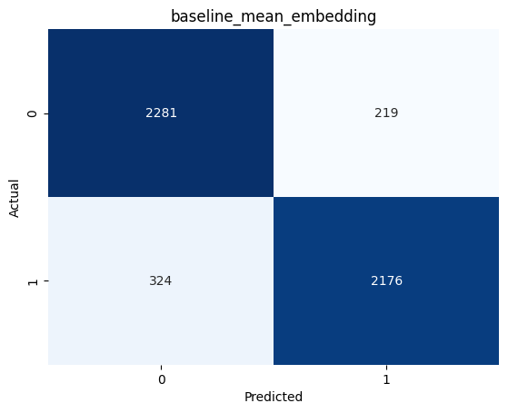
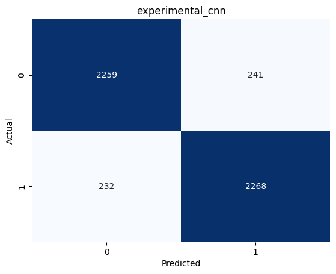
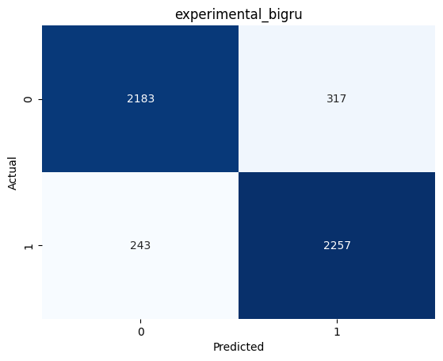

# Task 2 - Pratiksha Kaushik

Yelp Polarity sentiment classification with three models trained from scratch. All code, outputs and full metrics are in [task2_sentiment/Pratiksha_Kaushik](../../task2_sentiment/Pratiksha_Kaushik/README.md). The final notebook is [task2_yelp_sentiment_all_models.ipynb](../../task2_sentiment/Pratiksha_Kaushik/src/task2_yelp_sentiment_all_models.ipynb).

## Experiment

**Data.** I used Yelp Polarity from Hugging Face (`fancyzhx/yelp_polarity`): 560,000 train and 38,000 test reviews, perfectly balanced, with no missing values. With seed 9002, I took a stratified sample of 20,000 training reviews, split it 18,000 / 2,000 into train / validation, and sampled 5,000 test reviews.

**Preprocessing.** Each review is:
1. lowercased;
2. stripped of punctuation;
3. tokenized into words;
4. filtered with a small stopword list. "not", "never" and "no" are kept on purpose, because they flip the sentiment.

There is no stemming. The vocabulary is the 30,000 most common tokens in the training split, and reviews are cut at 180 tokens.

**Models.** No pretrained embeddings or language models were used. All embeddings are randomly initialized.

| Model | Architecture | Parameters |
|---|---|---|
| Baseline | 128-d embeddings, masked mean pooling, linear layer | 3,840,129 |
| Experimental 1 - CNN | 160-d embeddings, Conv1d with kernels 3/5/7 (128 channels each), global max pooling | 5,107,969 |
| Experimental 2 - BiGRU | 160-d embeddings, bidirectional GRU (128 hidden per direction), masked mean pooling | 5,022,977 |

**Training.** All three models used the same setup:
- AdamW (learning rate 1e-3, weight decay 1e-4), batch size 128, 5 epochs, gradient clipping at 1.0, BCE loss.
- The decision threshold was tuned on validation macro-F1 over the range 0.20-0.80.
- All three were trained in the same Colab session on an **NVIDIA Tesla T4** (PyTorch 2.11.0+cu130).

## Results (5,000 test reviews)

| Model | Threshold | Accuracy | Macro-F1 | ROC-AUC | PR-AUC | MCC | Brier | ECE |
|---|---|---|---|---|---|---|---|---|
| Baseline | 0.53 | 0.8914 | 0.8914 | 0.9574 | 0.9574 | 0.7835 | 0.0825 | 0.0530 |
| CNN | 0.56 | **0.9054** | **0.9054** | **0.9660** | **0.9652** | **0.8108** | **0.0717** | **0.0301** |
| BiGRU | 0.27 | 0.8880 | 0.8880 | 0.9601 | 0.9608 | 0.7763 | 0.0904 | 0.0711 |

Macro, micro and weighted precision, recall and F1 are all in [metrics_report.csv](../../task2_sentiment/Pratiksha_Kaushik/metrics_report.csv). Because the test set is exactly balanced, micro-F1 equals accuracy and weighted-F1 equals macro-F1.

**95% bootstrap confidence intervals (1,000 resamples)**

| Model | Accuracy | Macro-F1 | MCC |
|---|---|---|---|
| Baseline | 0.8826 - 0.8996 | 0.8826 - 0.8996 | 0.7662 - 0.7997 |
| CNN | 0.8974 - 0.9136 | 0.8974 - 0.9136 | 0.7950 - 0.8273 |
| BiGRU | 0.8790 - 0.8966 | 0.8788 - 0.8965 | 0.7584 - 0.7935 |

**Confusion matrices**

| Model | TN | FP | FN | TP |
|---|---|---|---|---|
| Baseline | 2281 | 219 | 324 | 2176 |
| CNN | 2259 | 241 | 232 | 2268 |
| BiGRU | 2183 | 317 | 243 | 2257 |

**Paired McNemar tests (exact)**

| Comparison | Baseline right, other wrong | Baseline wrong, other right | p-value |
|---|---|---|---|
| Baseline vs CNN | 168 | 238 | **0.0006** |
| Baseline vs BiGRU | 275 | 258 | 0.488 |

The CNN is significantly better than the baseline. The BiGRU is not significantly different from it.

**Robustness slices (macro-F1 / error rate)**

| Slice | n | Baseline | CNN | BiGRU |
|---|---|---|---|---|
| Short (<= 40 tokens) | 1622 | 0.884 / 0.112 | 0.900 / 0.097 | 0.872 / 0.121 |
| Medium (41-100) | 1921 | 0.887 / 0.113 | 0.905 / 0.095 | 0.895 / 0.105 |
| Long (> 100) | 1457 | 0.897 / 0.099 | 0.905 / 0.092 | 0.884 / 0.112 |
| Has negation | 2956 | 0.876 / 0.112 | 0.896 / 0.096 | 0.873 / 0.118 |
| No negation | 2044 | 0.879 / 0.103 | 0.891 / 0.092 | 0.874 / 0.104 |
| Low punctuation | 3896 | 0.883 / 0.117 | 0.896 / 0.104 | 0.879 / 0.121 |
| High punctuation (3+ `!`/`?`) | 1104 | 0.922 / 0.078 | 0.940 / 0.060 | 0.919 / 0.081 |

**Resources (Tesla T4, 18,000 reviews x 5 epochs)**

| Model | Parameters | Training time | Examples/s | Peak GPU memory |
|---|---|---|---|---|
| Baseline | 3.84M | 6.3 s | 14,181 | 100.5 MB |
| CNN | 5.11M | 19.0 s | 4,742 | 236.1 MB |
| BiGRU | 5.02M | 16.0 s | 5,616 | 558.2 MB |

| Baseline | CNN | BiGRU |
|---|---|---|
|  |  |  |

## Manual error review

I reviewed 20 errors from the best model (the CNN): 5 confident false positives, 5 confident false negatives, 5 near-threshold errors and 5 slice-specific errors. For each one, [manual_error_review_all_models.csv](../../task2_sentiment/Pratiksha_Kaushik/outputs/manual_error_review_all_models.csv) has the review text, true label, prediction, probability, an error type and a testable fix. The write-up is in [failure_analysis.md](../../task2_sentiment/Pratiksha_Kaushik/failure_analysis.md).

| Error type | Count |
|---|---|
| Mixed reviews (praise and complaint in the same review) | 9 |
| Negation / contrast | 3 |
| Ending decides the label (one case cut off by the 180-token limit) | 2 |
| Sarcasm / indirect wording | 2 |
| Label noise or non-English text | 2 |
| Short positive reviews predicted negative | 2 |

## Comparison of my three models

- **The CNN is best on every metric and every slice.** Kernels of width 3, 5 and 7 capture short phrases like "not good" or "least favorite", which a mean of word vectors loses. It is also the best calibrated model.
- **The BiGRU did not help here.** Its validation F1 peaked at epoch 3 (0.901) and dropped to 0.890 by epoch 5 as it overfit on only 18k reviews. I kept the last-epoch weights, so it is under-reported. Its unusual 0.27 threshold also shows its probabilities are shifted.
- **The baseline is a strong, cheap reference.** It is 1.4 points behind the CNN, about 3x faster, and uses the least memory.

## Comparison with my teammate (Yuyao Ding)

Yuyao's numbers come from their [metrics report](../../task2_sentiment/Yuyao_Ding/metrics_report.csv).

| Model | Accuracy | Macro-F1 | ROC-AUC | MCC | ECE |
|---|---|---|---|---|---|
| Mine - baseline | 0.8914 | 0.8914 | 0.9574 | 0.7835 | 0.0530 |
| Mine - CNN | 0.9054 | 0.9054 | 0.9660 | 0.8108 | 0.0301 |
| Mine - BiGRU | 0.8880 | 0.8880 | 0.9601 | 0.7763 | 0.0711 |
| Yuyao - baseline | 0.9324 | 0.9324 | 0.9797 | 0.8649 | 0.0050 |
| Yuyao - TextCNN | 0.9388 | 0.9388 | 0.9849 | 0.8777 | 0.0026 |
| Yuyao - BiLSTM | 0.9475 | 0.9475 | 0.9888 | 0.8951 | 0.0091 |

- **Yuyao's models are 3-6 points better, mainly because of data.** They trained on about 504k reviews (28x mine) and tested on all 38k. Even their baseline beats my best model.
- **The recurrent model ranks oppositely.** It is their best model (the BiLSTM, with lots of data and early stopping) and my worst (the BiGRU, small data, no early stopping). With little data, a CNN is the safer choice.
- **In both setups the CNN beats the mean baseline significantly.** My p-value is 0.0006; theirs is 9.5e-9.
- **Their calibration is much better.** Their ECE is 0.003-0.009, against my 0.03-0.07.
- **Speed isn't directly comparable** because we used different GPUs (my T4 vs their RTX 4090) and different amounts of data.

## Strengths, weaknesses and limitations

**Strengths:**
- The comparison is complete and fair: same split, same seed, and thresholds tuned on validation only.
- It includes statistical tests, calibration and slice analysis.
- The CNN improvement is significant.

**Weaknesses and limitations:**
- Only 20k of the 560k reviews were used, with 5 epochs and a single seed.
- There was no early stopping, which hurt the BiGRU.
- The 180-token cutoff drops the end of long reviews.
- "but" is in the stopword list, so contrast is removed before the model sees it.
- Yelp stores newlines as the literal text `\n`, which my tokenizer turns into a stray `n` token (the most common token in the vocabulary).
- GPU runs are not fully deterministic: an earlier run gave the CNN 0.9096.

## Future improvements

1. Train on far more of the data (100k+ reviews) with early stopping on validation F1.
2. Keep "but" and "however", and replace `\n` before tokenizing.
3. Raise the maximum length to 400, or keep the head and tail of long reviews.
4. Use subword tokens to reduce unknown words.
5. Add temperature scaling for calibration.
6. Run several seeds and report the mean and standard deviation.
