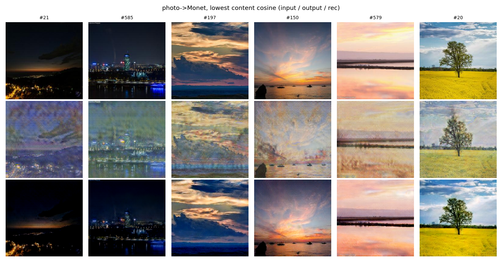
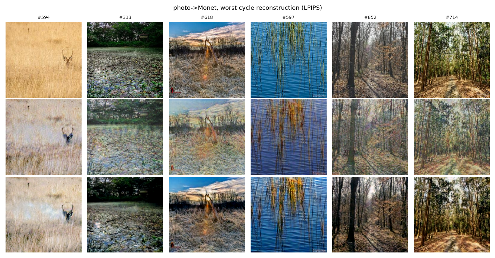

# Task 3 - Pratiksha Kaushik

Unpaired Monet ↔ Photo translation with a CycleGAN trained from scratch. The final model is **v3**, from [Pratiksha_cyclegan_monet_v3.ipynb](../../task3_gan/Pratiksha_Kaushik/src/Pratiksha_cyclegan_monet_v3.ipynb). Everything else is in [task3_gan/Pratiksha_Kaushik](../../task3_gan/Pratiksha_Kaushik/README.md): code, the raw log, histories, figures, all metrics, failure analysis and the reproducibility manifest.

Personal parameters: SID4 9002, seed 9002, SLICE 2, HP_ID 2. Hardware: NVIDIA GeForce RTX 4090, Python 3.10.13, torch 2.1.2, bf16.

## Experiment

**Data.** I used the Kaggle "I'm Something of a Painter Myself" data: 300 Monet paintings and 7,038 photos. The photos were split into 5,772 for training and 1,000 held out. The 300 photos that the course script scores were left out of training, so the score has no leakage.

**Model.** No pretrained weights were used in training. Inception-v3 and AlexNet are used only to compute FID/KID and LPIPS.

| Part | Setting |
|---|---|
| Generators | 2 × ResNet with 9 residual blocks, 11.38M parameters each |
| Discriminators | 2 × PatchGAN at 2 scales, 5.53M parameters each (33.82M in total) |
| Loss | LSGAN + 10·cycle L1 + 1·identity L1 |
| Training | 80 epochs (64,000 steps), batch 4, Adam 2e-4; constant for 40 epochs, then linear decay |
| Extras | DiffAugment (colour + translation), image pool of 50, EMA generators (0.999) |
| Final weights | EMA weights averaged over epochs 60, 65 and 70, plus global colour calibration on Monet→photo (`checkpoints/best_ema_v3_final.pt` + `color_cal.pt`, [Google Drive](https://drive.google.com/drive/folders/1Ce8xc2Tt_9E9ZXQC9ou5aPAu1iLHpdq2?usp=drive_link)) |

**How I got to v3.** v1 was a standard baseline (λ_id 5, one discriminator scale, 50 epochs). For v3, I screened 4 configurations for 15 epochs each, scoring them with the course metric on a separate validation set:

| Config | λ_cyc | λ_id | D scales | Score |
|---|---|---|---|---|
| **ms_id1 (chosen)** | 10 | 1 | 2 | **54.26** |
| ms_cyc5_id1 | 5 | 1 | 2 | 54.79 |
| base (v1 settings) | 10 | 5 | 1 | 55.63 |
| id1 | 10 | 1 | 1 | 56.12 |

The second discriminator scale was the change that helped. Lowering λ_id on its own did not help.

## Final result (course evaluation script, first 300 files per direction)

| Model | Photo→Monet FID | Monet→Photo FID | FID | MiFID | Score (FID+MiFID)/2 ↓ |
|---|---|---|---|---|---|
| v1 baseline | 101.51 | 102.99 | 102.25 | 0.4168 | 51.33 |
| **v3 final** | **100.54** | **99.58** | **100.06** | **0.4135** | **50.24** |

[final_submission.csv](../../task3_gan/Pratiksha_Kaushik/final_submission.csv) (uploaded to Kaggle as `submission.csv`) contains `1,100.05676111548,0.41345334997946315`, exactly as written by the v3 notebook.

## Full metrics (v3, 1,000 held-out photos vs 300 Monets)

| Metric | Photo→Monet | Monet→Photo |
|---|---|---|
| FID ↓ | 93.22 | 85.95 |
| KID ×10³ ↓ | 20.63 ± 2.06 | 19.51 ± 2.20 |
| Precision / Recall | 0.483 / 0.590 | 0.713 / 0.436 |
| Density / Coverage | 0.408 / 0.837 | 0.719 / 0.451 |
| Content cosine (input vs output) ↑ | 0.734 | 0.785 |
| LPIPS input vs translation | 0.389 | 0.348 |
| Cycle reconstruction L1 ↓ | 0.117 (photo cycle) | 0.073 (Monet cycle) |
| LPIPS input vs reconstruction ↓ | 0.210 | 0.287 |

Reference points:
- The FID between two halves of the real held-out photos is 57.32.
- Unrelated image pairs give L1 0.574, LPIPS 0.811 and content cosine 0.569.
- The memorisation distance is 0.255 (above 0.1 means no copying of training Monets).

All nine cycle-consistency implementation checks pass.

## Training behaviour and stability

| | v3 |
|---|---|
| Discriminator loss (last 25% of steps) | 0.245 |
| Generator adversarial loss (last 25%) | 1.214 |
| Cycle L1 (first 25% → last 25%) | 0.280 → 0.122 |
| Identity L1 (last 25%) | 0.161 |
| Gradient norm G, median / p99 / max | 16.3 / 33.7 / 146.8 |
| Gradient norm D, median / p99 / max | 7.3 / 18.8 / 434.9 |
| NaN / Inf steps | 0 of 64,000 |

Training was stable, with bounded gradients and only rare spikes. Over the last ~20 epochs the discriminator loss kept falling (about 0.36 → 0.22) while the validation score stopped improving. That is why I averaged epochs 60-70 instead of using the last epoch. The per-step values are in `data_processed/train_history_v3.csv`. The plots are `outputs/figures/loss_curves.png` and `stability_curves.png`.

**Validation score per checkpoint (lower is better):**

| Epoch | 5 | 25 | 40 | 50 | 60 | 70 | 80 | avg 60/65/70 |
|---|---|---|---|---|---|---|---|---|
| Score | 61.75 | 52.79 | 50.78 | 49.52 | 48.61 | 48.46 | 48.96 | **48.28** |

## Efficiency

| | v3 |
|---|---|
| Parameters | 33.82M (G 2 × 11.38M, D 2 × 5.53M) |
| Training time | 3.20 h (64,000 steps) |
| Training throughput | 22.2 images/s per domain |
| Inference throughput (batch 16) | 505 images/s |
| Peak GPU memory, training / inference | 6.33 GB / 2.99 GB |

## Qualitative results

`outputs/figures/qual_photo2monet.png` and `qual_monet2photo.png` each show three rows: the input, the translation and the cycle reconstruction.

- **Works well:** coastlines, water, waves and mid-tone landscapes get a pastel palette, soft edges and brush-like texture while keeping their layout.
- **Fails on:**
  - night scenes (washed out to grey-blue);
  - smooth skies (blotches and streaks);
  - dense fine texture (grass and reeds lost);
  - foggy Monets in the Monet→photo direction (the generator invents a different scene).

Worst cases (lowest content similarity and worst cycle reconstruction, photo→Monet):

All figures are also on [Google Drive](https://drive.google.com/drive/folders/1EXP4Iq-KOcFrWSmeZKD6gqnB6YQxDPTH).

The full write-up of 7 failure categories is in [failure_analysis.md](../../task3_gan/Pratiksha_Kaushik/failure_analysis.md). One key finding: content that disappears in a translation often comes back almost perfectly in the reconstruction. This is CycleGAN's "steganography" effect, so a low cycle L1 does not prove that the translation is faithful.

## Human audit (30 fixed samples, 2 raters)

The blinded packet is in `outputs/human_audit/`: 20 photo→Monet and 10 Monet→photo samples, shuffled. Each sample is rated 1-5 on style, content preservation and artifacts.

| Criterion | Rater 1 mean | Rater 2 mean | Both | Exact agreement | Within ±1 | Cohen's kappa | Quadratic-weighted kappa |
|---|---|---|---|---|---|---|---|
| Style | 3.50 | 3.53 | 3.52 | 50% | 100% | 0.23 | 0.60 |
| Content | 3.93 | 3.93 | 3.93 | 60% | 100% | 0.29 | 0.49 |
| Artifacts | 3.10 | 2.93 | 3.02 | 50% | 100% | 0.22 | 0.52 |

**Overall human-audit score: 3.49 / 5** (mean of all three criteria, both raters).

| Direction | Style | Content | Artifacts |
|---|---|---|---|
| Photo → Monet (20 samples) | 3.40 | 3.78 | 2.80 |
| Monet → Photo (10 samples) | 3.75 | 4.25 | 3.45 |

**Reading the numbers:**
- **Content preservation is the strongest criterion (3.93).** Both raters agreed the scene layout is usually kept. This matches the content cosine of 0.73-0.79.
- **Artifacts are the weakest (3.02).** Both raters' notes mention colour blotches, smears and halos. These are the same failure types listed in `failure_analysis.md`.
- **Agreement:** the raters never differed by more than 1 point (100% within ±1) and gave the same score 50-60% of the time. Unweighted kappa is 0.22-0.29 ("fair" on the Landis & Koch scale). Quadratic-weighted kappa, which gives credit for near-misses on a 1-5 scale, is 0.49-0.60 ("moderate"). The low unweighted kappa comes from many 3-vs-4 splits, not from real disagreement.
- **Monet → Photo was rated higher than Photo → Monet** on all three criteria, even though Photo → Monet has the better FID. There are only 10 Monet → Photo samples, so this difference is uncertain.

Files: `task3_gan/Pratiksha_Kaushik/outputs/human_audit/rater1.csv`, `rater2.csv` (scores and notes), `audit_summary.csv`, `audit_scores_per_sample.csv`.

## Kaggle leaderboard

| Public score | Private score | Final rank |
|---|---|---|
| **50.2367** | PENDING (if shown) | PENDING |

The public score matches the local course-script score (50.2351) to within 0.002, so the local evaluation is a reliable estimate of the leaderboard result.

## Comparison with my teammate (Yuyao Ding)

Yuyao's Task 3 results are in their own report ([Task3_Yuyao_Ding.md](../Task3_Yuyao_Ding.md)). We trained independently. A joint comparison table will be added to the combined team report.

## Strengths, weaknesses and limitations

**Strengths:**
- The official score has no leakage, because the scored photos were excluded from training.
- Configurations were chosen by a systematic screen instead of guessing.
- Checkpoints were selected on a separate validation set.
- Training was stable (0 NaN steps), and the metric suite is complete.

**Weaknesses and limitations:**
- With only 300 Monets, there is little variety in style (no night scenes or saturated colours).
- Monet→photo is the weaker direction (recall 0.44).
- v3 changes content more than v1 does (lower content cosine, higher cycle L1), because the identity weight is lower.
- The discriminators start to dominate late in training.
- Each configuration was run with a single seed.

## Future improvements

1. Replace transposed convolutions with resize-convolutions to reduce streaks in smooth regions.
2. Add spectral normalization to the discriminators to slow their late-training dominance.
3. Use a perceptual (feature-level) cycle loss to keep more fine texture.
4. Use a stronger identity or cycle weight for the Monet→photo direction only.
5. Add noise to translations before the reverse generator, so information can't be hidden in the reconstruction.
