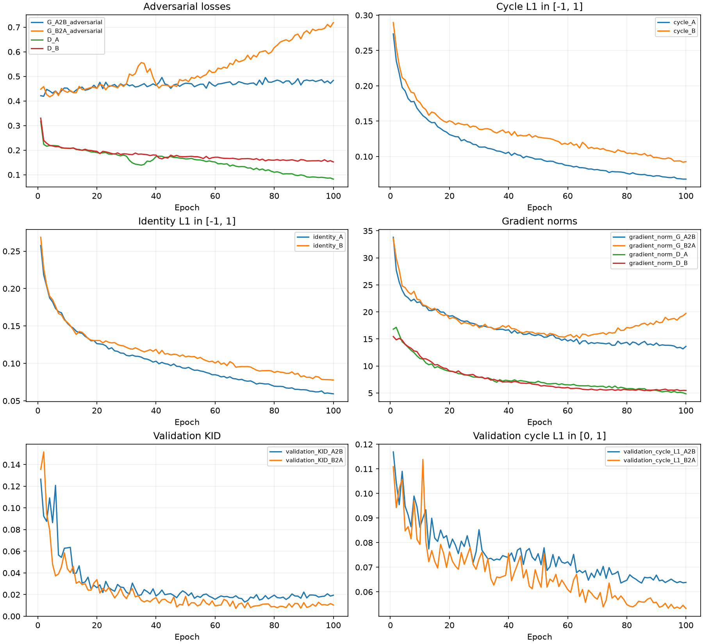
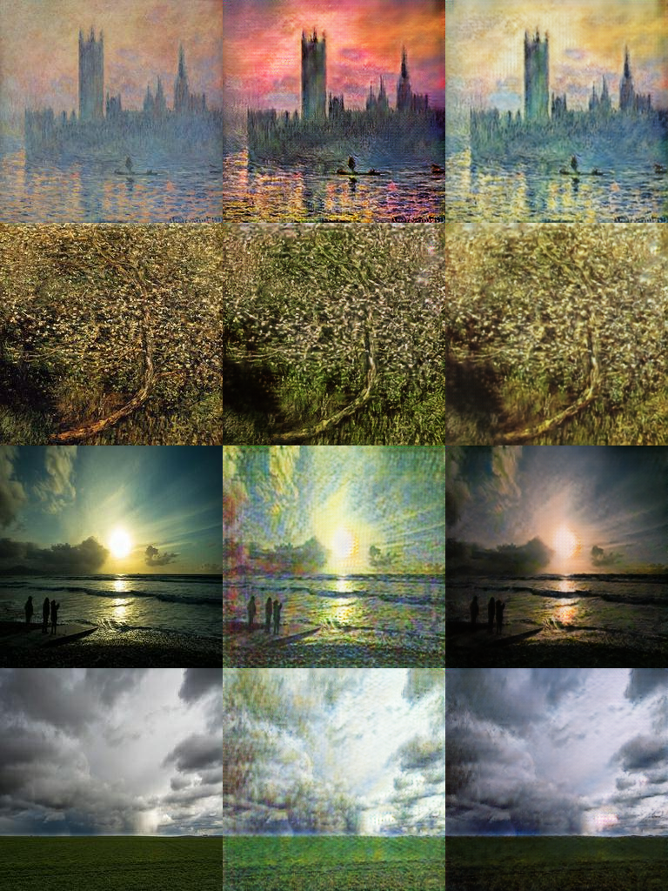

# Task 3 - Yuyao Ding

This contribution records the completed nine-block CycleGAN run `task3_formal_20260927T075834Z_d335ae80`.
Epoch 70 was selected by validation KID after 100 epochs / 100,000 updates.
Human ratings, actual Kaggle score/rank and the teammate comparison remain pending.
The [full results](../task3_gan/Yuyao_Ding/results.md) contain the protocol definitions,
source links and comparison with the preserved quick baseline.

## Experiment and data

Two ResNet generators translate between Monet paintings (A) and photographs (B).
Each generator has nine residual blocks, 64 base channels and two transpose-convolution
upsampling layers. Two 70 x 70 PatchGAN discriminators use 64 base channels. Instance
normalization has no affine parameters or running statistics; there is no dropout.
Convolution weights use normal initialization with standard deviation 0.02.
All CycleGAN weights were trained from scratch. Pretrained Inception-v3 and AlexNet
are used only for evaluation, never to generate submitted images.

The objective combines least-squares adversarial loss, cycle L1 with weight 10 and
identity L1 with weight 5, summed over both directions. The identity coefficient is
equivalent to the authors' 0.5 times the cycle weight of 10. Each discriminator uses
half the sum of its real-target and fake-target squared errors. The two cycles are
Monet -> Photo -> Monet and Photo -> Monet -> Photo.

Adam uses learning rate 0.0002, betas (0.5, 0.999), batch size 1 and a replay pool of 50
per domain. FP32 training ran for 100 epochs of 1,000 updates: 50 constant-rate epochs
then 50 linearly decaying epochs. The final learning rate was 0.00000392157. This is
a reduced compute budget, not the authors' 200-full-epoch protocol. Images are resized
to 286 x 286, cropped randomly to 256 x 256, horizontally flipped and normalized to
[-1,1]. A follows shuffled indices modulo its size; B is drawn with replacement
from the full training domain. Complete coverage is not required in each 1,000-step
epoch, and the data are not reduced to a fixed 1,000-image subset.

Raw data contains 300 Monet paintings and 7,038 photos. Seed 41 and duplicate-group
assignment produce these partitions; all original files are retained:

| Partition | Monet | Photo |
| --- | --- | --- |
| Train | 240 | 5,631 |
| Validation | 30 | 703 |
| Test | 30 | 704 |

The nine duplicate-photo groups do not cross partitions. Image hashes are checked
against the saved inventory. Training uses only the training partition. A fixed
30-image subset per validation domain selects the lowest mean bidirectional KID;
neither test images nor Kaggle scores select the checkpoint. Validation KID uses
10 subsets of 20 images. The final held-out evaluation uses the first 30 sorted
test filenames in each domain, balanced to the smaller Monet test set.

The course protocol separately evaluates the first 300 sorted raw filenames in each
domain, as specified by the supplied evaluation notebook. This includes training
images and is not an estimate of held-out generalization. Both protocols are retained
and labeled separately.

## Final results

The held-out results use 30 fixed images per direction:

| Metric | Monet -> Photo (A2B) | Photo -> Monet (B2A) |
| --- | --- | --- |
| Images per direction | 30 | 30 |
| FID | 176.1675 | 208.0610 |
| KID, raw scale | 0.018444 | 0.014324 |
| Course MiFID | 0.418549 | 0.408350 |
| Generative precision | 0.9333 | 0.4333 |
| Generative recall | 0.4333 | 0.8333 |
| Density | 1.7933 | 0.3067 |
| Coverage | 0.9333 | 0.7667 |
| Cycle L1, pixels in [0,1] | 0.066813 | 0.061143 |
| LPIPS, input vs translation | 0.293948 | 0.388009 |
| LPIPS, input vs cycle | 0.292868 | 0.231483 |
| Content cosine | 0.814094 | 0.751451 |
| Translation images/s, including I/O | 70.11 | 85.80 |

The separate course protocol uses 300 images per direction, including training images:

| Metric | Monet -> Photo (A2B) | Photo -> Monet (B2A) |
| --- | --- | --- |
| Images per direction | 300 | 300 |
| FID | 103.4908 | 107.0100 |
| Course MiFID | 0.424612 | 0.413559 |
| KID, raw scale | 0.018389 | 0.012290 |
| KID subset standard deviation | 0.002251 | 0.002138 |
| Generative precision | 0.7400 | 0.4600 |
| Generative recall | 0.4733 | 0.7000 |
| Density | 0.9400 | 0.3500 |
| Coverage | 0.8633 | 0.6267 |
| Content cosine | 0.831027 | 0.773844 |
| Translation images/s, including I/O | 88.83 | 84.35 |

The local submission CSV contains mean FID **105.250404** and mean MiFID **0.419085**.
Actual Kaggle public/private scores and rank are pending. These CSV values are not
leaderboard results. Human mean style/content/artifact-free scores and inter-rater
agreement are also pending the two independent 30-case rating forms.

FID and KID use the supplied course notebook's Inception-v3 preprocessing.
FID's 2,048-dimensional covariance estimate is rank deficient with these sample counts;
the 30-image held-out estimates are noisy. KID is raw, unbiased polynomial MMD, not
multiplied by 1,000. The held-out KID uses all 30 images in each subset, so its near-zero
subset standard deviation reflects reuse of the same set, not certainty. Course KID
uses 50 subsets of 100 images. Subset standard deviation is not a confidence interval.

Generative precision/recall and density/coverage use five-nearest-neighbour radii.
Cycle L1 is reported in [0,1], while training cycle and identity components below use
[-1,1]. LPIPS uses AlexNet v0.1 on input vs translation and input vs cycle; no paired
target image is available, so a lower translation LPIPS alone does not establish
better style transfer. Content cosine compares Inception features of the input and
its exported JPEG. Course MiFID is cosine distance after sorting and matching by
index; it is not a nearest-neighbour memorization score.

## Training stability and resources

Training completed 100,000 logged updates with no NaN/Inf values. Mean validation KID
fell from 0.131001 at epoch 1 to its minimum of 0.010435 at epoch 70. It was 0.014916
at epoch 100. Mean KID over successive ten-epoch windows from epoch 51 onward was
0.01508, 0.01418, 0.01364, 0.01394 and 0.01463. The late validation curve is broadly
flat, with no improvement over the selected epoch; this does not support a claim
that simply extending the same schedule would improve quality.

Cycle and identity losses decrease throughout training. Photo -> Monet adversarial
loss rises late while the Monet discriminator loss declines, showing that the
discriminator increasingly separates those translations from real paintings.
Generator gradients stay finite but the Photo -> Monet norm rises modestly late.
This is a remaining adversarial-balance concern, not evidence of numerical failure.
The inspected fixed examples retain distinct scene layouts; they do not show all
inputs collapsing to one image. Repeated textures and limited realism remain visible.

The training means below give unweighted cycle/identity components in [-1,1]:

| Training mean | Selected epoch 70 | Final epoch 100 |
| --- | --- | --- |
| G Monet -> Photo adversarial | 0.470378 | 0.483592 |
| G Photo -> Monet adversarial | 0.567938 | 0.718688 |
| D Monet | 0.132709 | 0.082222 |
| D Photo | 0.165089 | 0.152003 |
| Cycle Monet L1 | 0.081600 | 0.068002 |
| Cycle Photo L1 | 0.111967 | 0.092694 |
| Identity Monet L1 | 0.076947 | 0.059414 |
| Identity Photo L1 | 0.095761 | 0.077825 |
| Total generator objective | 3.837529 | 3.495433 |
| Gradient norm G Monet -> Photo | 14.310256 | 13.631759 |
| Gradient norm G Photo -> Monet | 15.918826 | 19.743037 |
| Gradient norm D Monet | 6.193459 | 4.861524 |
| Gradient norm D Photo | 5.558846 | 5.480059 |

| Measure | Recorded value |
| --- | --- |
| Parameters, each generator / each discriminator | 11,378,179 / 2,764,737 |
| Parameters, all four networks | 28,285,832 |
| Epochs / optimizer updates | 100 / 100,000 |
| Training image presentations, both domains | 200,000 |
| Training loops, seconds | 18321.28 |
| Training wall time, seconds | 18602.59 |
| Training images/s, both domains | 10.92 |
| Optimizer updates/s, training loops | 5.46 |
| Timed final evaluation, seconds | 41.54 |
| Peak CUDA allocated tensors, MiB | 2596.36 |
| Peak sampled process RSS, MiB | 3673.09 |
| NaN/Inf events | 0 |

Hardware/software: Windows 11, RTX 4090, Python 3.12.14, PyTorch 2.8.0+cu128,
FP32 and eight CPU threads. Combined image throughput counts both domains; it is
twice optimizer-update throughput. CUDA memory is peak allocated tensor memory,
and RAM is sampled process RSS. The recorded training wall time includes validation;
the separately timed evaluation excludes metric-network initialization.

## Comparison and visual limitations

| Configuration or metric | Quick baseline | Current run |
| --- | --- | --- |
| Generator / upsampling | 6 blocks / nearest resize + convolution | 9 blocks / transpose convolution |
| Batch size / precision | 2 / CUDA BF16 | 1 / FP32 |
| Updates / image presentations per domain | 40,000 / 80,000 | 100,000 / 100,000 |
| Learning-rate schedule | 20 constant + 20 decay epochs | 50 constant + 50 decay epochs |
| Selected epoch | 39 | 70 |
| Best validation mean KID | 0.018824 | 0.010435 |
| Held-out Monet -> Photo FID | 187.508314 | 176.167517 |
| Held-out Photo -> Monet FID | 213.523154 | 208.061045 |
| Held-out Monet -> Photo KID | 0.036695 | 0.018444 |
| Held-out Photo -> Monet KID | 0.019281 | 0.014324 |
| Held-out Photo -> Monet MiFID | 0.395402 | 0.408350 |
| Held-out Photo -> Monet coverage | 0.833333 | 0.766667 |
| Course mean FID | 115.195195 | 105.250404 |
| Course mean MiFID | 0.421838 | 0.419085 |

The data split, evaluator source and metric-network weights are identical across these
two recorded runs. Both directions improve on held-out FID and KID, and cycle
reconstruction improves. Improvements are not universal: Photo -> Monet held-out
MiFID rises from 0.395402 to 0.408350, and coverage falls from 0.8333 to 0.7667.
Course Photo -> Monet MiFID also rises slightly (0.410970 to 0.413559).

Architecture, upsampling, precision, batch size, sampling and training budget changed
together. These are whole-configuration comparisons, not an ablation proving that
nine residual blocks alone caused the gains. One seed was run, and the small held-out
set cannot establish statistical superiority or robust generalization.

Fixed images retain recognizable structures, but sunsets can shift toward yellow/green,
sky and water can acquire repeated fine texture, and thin objects can blur. Some
village scenes remain close to softly filtered photos rather than convincing paintings.
The reverse direction often retains painted strokes. Cycle reconstruction improves
without eliminating these style/realism problems. The
[eight-case analysis](../task3_gan/Yuyao_Ding/failure_analysis.md) separates observations
from untested hypotheses and links the original image panels.

## Evidence and remaining team work

- [Evaluation and checkpoint identity](../task3_gan/Yuyao_Ding/outputs/task3_formal_20260927T075834Z_d335ae80/evaluation_20260927T130841Z_a267de/evaluation.json).
- [Full metric CSV](../task3_gan/Yuyao_Ding/outputs/task3_formal_20260927T075834Z_d335ae80/evaluation_20260927T130841Z_a267de/full_metrics_report.csv).
- [Executed notebook](../task3_gan/Yuyao_Ding/outputs/task3_formal_20260927T075834Z_d335ae80/training_notebook.ipynb).
- [Frozen configuration, environment and source hashes](../reproducibility/manifests/Yuyao_Ding/task3_formal_20260927T075834Z_d335ae80/run.json).
- [Unedited epoch logs](../reproducibility/raw_logs/Yuyao_Ding/task3_formal_20260927T075834Z_d335ae80/epochs.jsonl).
- [Setup, demo and audit commands](../task3_gan/Yuyao_Ding/README.md).

Checkpoint SHA-256: `d22ff9d9de85ed8103f0cc7124a9007cd155ca4eaf21f993704cfcf02d2ddfbf`.
All local execution checks concern Windows CPU/CUDA; physical Mac/Linux/Colab runs
remain unverified. Add the real human audit, actual Kaggle scores/rank, teammate
architecture/hyperparameters/metrics and joint discussion before producing the final
combined team report. The teammate's final Task 3 implementation was not available
for comparison, so a substantive model difference has not yet been confirmed.

Reference: Jun-Yan Zhu, Taesung Park, Phillip Isola and Alexei A. Efros.
[Unpaired Image-to-Image Translation using Cycle-Consistent Adversarial Networks](https://arxiv.org/abs/1703.10593), ICCV 2017.
Implementation reference: [authors' PyTorch CycleGAN repository](https://github.com/junyanz/pytorch-CycleGAN-and-pix2pix).
