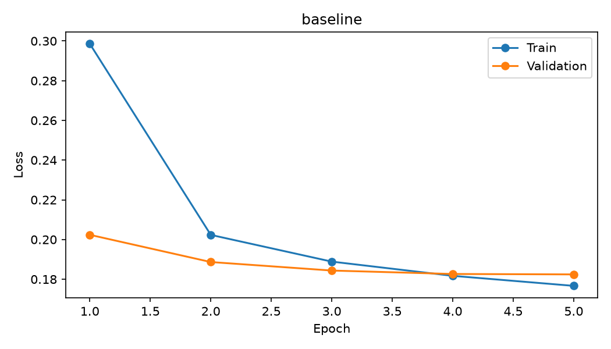
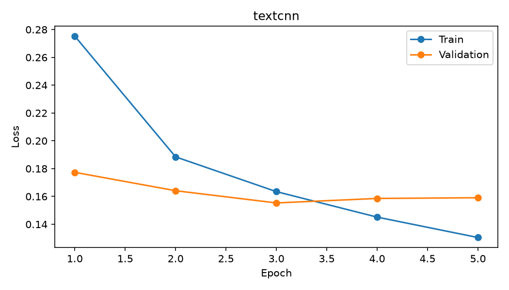
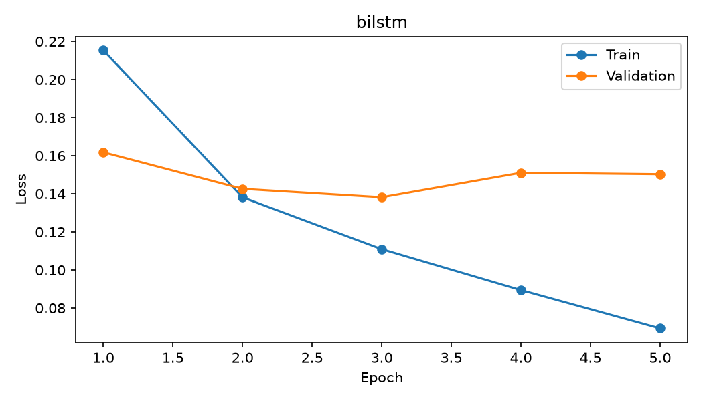

# Task 2 - Yuyao Ding

This is Yuyao's contribution to the combined team report. The formal session is
`task2_formal_20260927T020054Z_ba87cd57`. The teammate comparison and joint discussion remain to be added from
the teammate's verified final work. Full details are in [results.md](../../task2_sentiment/Yuyao_Ding/results.md).

## Experiment

Three sentiment models were trained from scratch: a masked mean-pooling baseline,
a TextCNN with 128 filters at widths 3/4/5, and a one-layer BiLSTM with 128 hidden
units per direction. All use trainable 128-dimensional word embeddings, a 50,000-word
vocabulary including special tokens, and a maximum length of 192 processed tokens.
Dropout is 0.30 / 0.50 / 0.40. Adam uses learning rate 0.001 and batch size 256;
seed 640 and the same per-epoch example shuffle are shared. The maximum is five
epochs, with validation-loss patience two and gradient clipping at 1 for BiLSTM.
No pretrained embeddings or models were used.

Yelp Polarity supplied 560,000 training and 38,000 balanced test reviews. Training
cleaning removed four conflicting-label rows, 62 duplicate rows and seven rows
overlapping raw test text. The stratified split contains 503,934 training and 55,993
validation rows. All 38,000 official test rows remain. Vocabulary and length bounds
are fitted on training only. Lowercasing, contraction normalization, punctuation and
stopword removal precede first-192 truncation and padding. Empty processed inputs
use UNK. [Data audit](../../reproducibility/manifests/Yuyao_Ding/task2_formal_20260927T020054Z_ba87cd57/preprocessing.json).

## Results

| Model | Test accuracy | Macro-F1 | Best epoch | Training wall time |
| --- | --- | --- | --- | --- |
| Baseline | 93.24% | 0.9324 | 5 | 1.91 min |
| TextCNN | 93.88% | 0.9388 | 3 | 2.30 min |
| BiLSTM | 94.75% | 0.9475 | 3 | 10.16 min |

| Test metric | Baseline | TextCNN | BiLSTM |
| --- | --- | --- | --- |
| Accuracy | 0.932447 | 0.938842 | 0.947526 |
| Precision, macro | 0.932461 | 0.938904 | 0.947553 |
| Recall, macro | 0.932447 | 0.938842 | 0.947526 |
| F1, macro | 0.932447 | 0.938840 | 0.947526 |
| Precision, micro | 0.932447 | 0.938842 | 0.947526 |
| Recall, micro | 0.932447 | 0.938842 | 0.947526 |
| F1, micro | 0.932447 | 0.938842 | 0.947526 |
| Precision, weighted | 0.932461 | 0.938904 | 0.947553 |
| Recall, weighted | 0.932447 | 0.938842 | 0.947526 |
| F1, weighted | 0.932447 | 0.938840 | 0.947526 |
| ROC-AUC | 0.979742 | 0.984943 | 0.988794 |
| PR-AUC (trapezoidal) | 0.979582 | 0.985341 | 0.989155 |
| Average precision | 0.979538 | 0.985341 | 0.989155 |
| MCC | 0.864908 | 0.877746 | 0.895079 |
| Brier score (lower is better) | 0.050910 | 0.045303 | 0.039617 |
| ECE (lower is better) | 0.005033 | 0.002623 | 0.009108 |

| 95% bootstrap interval | Baseline | TextCNN | BiLSTM |
| --- | --- | --- | --- |
| Accuracy | 0.929947 - 0.935159 | 0.936474 - 0.941369 | 0.945474 - 0.949921 |
| Macro-F1 | 0.929946 - 0.935156 | 0.936473 - 0.941360 | 0.945472 - 0.949918 |
| MCC | 0.859910 - 0.870349 | 0.873040 - 0.882777 | 0.890981 - 0.899865 |

Metrics use a fixed 0.5 decision threshold. Macro averages classes equally; weighted
averages use support; micro aggregates class counts. PR-AUC is trapezoidal, while AP
is reported separately. Brier is mean squared probability error; ECE uses ten
equal-width predicted-class confidence bins. Intervals are percentile intervals from
1,000 paired row bootstrap resamples with seed 640. They do not measure retraining
variability. [Formulas and confusion matrices](../../task2_sentiment/Yuyao_Ding/results.md#metric-definitions).

| Baseline compared with | Baseline only correct | Other only correct | Exact p | Holm p |
| --- | --- | --- | --- | --- |
| textcnn | 770 | 1013 | 9.48e-09 | 9.48e-09 |
| bilstm | 669 | 1242 | 1.07e-39 | 2.14e-39 |

McNemar comparisons pair the same test IDs and labels. Both experimental models
improve over the baseline in this run after Holm correction for two comparisons.
No inferential comparison between TextCNN and BiLSTM is claimed.

| Measure | Baseline | TextCNN | BiLSTM |
| --- | --- | --- | --- |
| Trainable parameters | 6,400,129 | 6,597,377 | 6,664,449 |
| Epochs completed | 5 | 5 | 5 |
| Training loop, seconds | 105.48 | 127.77 | 577.64 |
| Training wall time, seconds | 114.32 | 138.06 | 609.81 |
| Training examples / second | 23888.54 | 19720.45 | 4362.04 |
| Peak CUDA allocation, MiB | 166.98 | 298.79 | 378.29 |
| Process-lifetime peak RSS, GiB | 6.45 | 6.45 | 6.45 |

The run used Windows 11, Intel Core i9-14900KF and RTX 4090, Python 3.12.14 and
PyTorch 2.8.0+cu128. Wall time includes validation/checkpoint work but not preprocessing
or final evaluation. CUDA figures measure allocated tensors; RSS is a shared
process-lifetime peak, not isolated model RAM. [Environment](../../reproducibility/manifests/Yuyao_Ding/task2_formal_20260927T020054Z_ba87cd57/environment.json).

## Interpretation

The baseline nearly plateaus by epoch five. Both experimental models have their
lowest validation loss at epoch three and show overfitting afterward; their test
metrics use the epoch-three checkpoints. BiLSTM is best on accuracy and macro-F1,
improving accuracy by 1.51 points over the baseline. TextCNN has the
lowest ECE. Dropout and clipping differ as well as architecture, and only one seed
was run, so these are configuration comparisons rather than isolated architecture effects.

| Test slice | n (negative / positive) | Baseline F1 | TextCNN F1 | BiLSTM F1 |
| --- | --- | --- | --- | --- |
| length_short | 9590 (3837 / 5753) | 0.9294 | 0.9346 | 0.9457 |
| length_medium | 18952 (9397 / 9555) | 0.9338 | 0.9415 | 0.9493 |
| length_long | 9458 (5766 / 3692) | 0.9262 | 0.9318 | 0.9406 |
| has_negation | 27949 (16481 / 11468) | 0.9253 | 0.9350 | 0.9444 |
| no_negation | 10051 (2519 / 7532) | 0.9260 | 0.9236 | 0.9342 |
| truncated | 1751 (1149 / 602) | 0.9038 | 0.9030 | 0.9057 |
| not_truncated | 36249 (17851 / 18398) | 0.9333 | 0.9401 | 0.9491 |
| empty_after_preprocessing | 1 (1 / 0) | 0.0000 | 0.0000 | 0.0000 |

Length slices use training raw-word quartiles (51 and 173). Slices overlap and have
different class balances. Truncated inputs are harder: BiLSTM errors are 8.45% on
1,751 truncated reviews versus 5.09% on 36,249 untruncated reviews. The one empty
processed test case is missed by all models and cannot support a subgroup conclusion.

## Error analysis and limitations

Twenty distinct errors per model have been analyzed: five confident false positives,
five confident false negatives, five near the threshold and five from predefined
long/negation slices. The 60 entries include 53 unique reviews and no shortages.
The [full analysis](../../task2_sentiment/Yuyao_Ding/failure_analysis.md) provides exact
excerpts, IDs, probabilities, processed lengths, observations and testable proposals.

Representative cases:

- `test_17640`, baseline: "my least favorite" becomes "buffets vegas favorite".
  Stopword removal discards the negative comparison.
- `test_37771`, TextCNN/BiLSTM: "DO NOT EAT AT THIS LOCATION" follows praise for
  the chain. Both models confuse the branch complaint with general praise.
- `test_30793`, TextCNN/BiLSTM: "Now its much better" reverses an older complaint.
  All 46 processed tokens fit, so this is not lost-tail context.
- `test_20061`, TextCNN/BiLSTM: the positive conclusion "Can't beat that!" falls
  beyond the first 192 of 290 processed tokens.
- `test_30958`, TextCNN/BiLSTM: the manager's resolution remains in the first 192
  tokens; only the final "thank" is omitted. A longer limit alone is not a sufficient explanation.

Literal escaped newlines can also leave n tokens, and number-word rating cues can
be removed as stopwords. Some supplied labels are ambiguous from text alone. Those
labels and the completed preprocessing remain unchanged. These selected examples
are not a random estimate of error frequencies, and model-mechanism explanations
are hypotheses rather than measured attributions.

Future validation experiments could compare lighter stopword filtering, escape
normalization and head-plus-tail inputs one at a time. The reviewed test set must
not become a tuning set presented later as untouched evaluation.

## Reproduction and remaining team work

[Setup, reproduction and demo](../../task2_sentiment/Yuyao_Ding/README.md) cover Windows,
Mac, Linux and optional Colab. Windows CPU/CUDA were tested; physical Mac/Linux/Colab
checks are still pending. The executed training notebook stays unchanged. The
independent demo uses the frozen definitions and checkpoint vocabulary without data
loading or retraining. [Verification](../../reproducibility/manifests/Yuyao_Ding/task2_closeout_checks.json).

The [full metrics table](../../task2_sentiment/Yuyao_Ding/metrics_report.csv) links every
value to evidence. Run manifests map logs, outputs and checkpoints. The main run IDs
end in `_baseline`, `_textcnn`, and `_bilstm`; their matching `best.pt` files are kept.

Before the final team PDF, add the teammate's confirmed architecture/hyperparameter
differences, metric tables and jointly written interpretation. Complete the shared
checkpoint backup/download link and destination-machine demo check at handoff.
