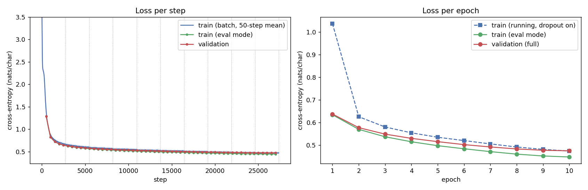

# Task 1 - Character-level GPT on TinyStories (Pratiksha Kaushik)

A GPT-style decoder-only Transformer, written from scratch and trained on characters from TinyStories. Multi-head self-attention, the causal mask, LayerNorm, the feed-forward network, residual connections, token and positional embeddings, and the LM head are all implemented with plain tensor operations. No `nn.Transformer`, `nn.MultiheadAttention` or `scaled_dot_product_attention` is used.

**All files (checkpoints, processed data, outputs) are also on Google Drive:**
https://drive.google.com/drive/folders/19nN7gGNHc0h4IRYNC6TQ93BOfXxahAct?usp=drive_link

## Final result

Run `20261005-223946_L8H8C512T512`: 8 layers, 8 heads, 512-d, context 512, 25.56M parameters, 10 epochs on an NVIDIA A100-SXM4-40GB.

| Metric | Value |
|---|---|
| Train / validation cross-entropy | 0.4476 / 0.4742 nats/char |
| Validation perplexity | 1.607 |
| Validation bits-per-character | 0.684 |
| Generalization gap | +0.0266 nats/char (5.95%) |
| Top-1 next-character accuracy (val) | 84.74% |
| Distinct-1 / 2 / 3 (t = 0.8) | 0.212 / 0.655 / 0.869 |
| Repeated 4-gram rate (t = 0.8) | 1.35% |
| Loss spikes / NaN steps | 0 / 0 |
| Training throughput | 452,013 tokens/s |
| Generation throughput | 96 tokens/s (batch 1), 2,182 tokens/s (batch 32) |
| Peak GPU memory | 10.59 GiB |
| Total training time | 36.9 min |



Full write-up: [results.md](results.md). Failure cases: [failure_analysis.md](failure_analysis.md). Every metric: [metrics_report.csv](metrics_report.csv).

## Folder layout

```
Pratiksha_Kaushik/
├── README.md                this file
├── results.md               architecture, hyperparameters, design decisions, all metrics, interpretation
├── failure_analysis.md      3 generated-text failure cases (repetition, invented words, loss of coherence)
├── metrics_report.csv       every required metric
├── RUN_LOG.txt              full training log of the final run (648 lines: setup, every step, every epoch, evaluation)
├── configs/config.json      exact training config of the final run
├── src/
│   ├── Task1_gpt.ipynb                      final notebook (8L / 512d / context 512)
│   └── Task1_gpt_pilot_L6H6C384T256.ipynb   earlier pilot run (6L / 384d / context 256)
├── checkpoints/             (git-ignored; download: https://drive.google.com/drive/folders/18IwhldDiOowviFXWqD22ZC2dRBwvGPEF?usp=drive_link)
│   ├── ckpt_best.pt         model weights, epoch 10 (val CE 0.4742), 102 MB
│   └── ckpt_last.pt         full training state for resuming, 307 MB
├── data_processed/          (README + small JSON files in git; .npy files on Google Drive)
│   ├── README.md            what each file is, how the split and encoding were made
│   ├── vocab.json           char_to_idx / idx_to_char (80 symbols)
│   ├── split_indices.json   which TinyStories rows went to train (100,000) and val (10,000)
│   ├── train_ids.npy, val_ids.npy   encoded character ids
│   └── dataset_stats.json
├── outputs/
│   ├── plots/               loss curves, LR schedule (warm-up + cosine), stability, story lengths
│   ├── samples/             generated text: showcase (greedy + temperature), unconditional t=0.8
│   ├── metrics/             per-step and per-epoch metrics, diversity, quick evals, metrics.json
│   └── human_audit.csv
└── reproducibility/
    ├── raw_logs/
    │   ├── ..._runlog.txt                       log file written during the run (stops after setup)
    │   └── ..._runlog_from_notebook_output.txt  the full 648-line log, taken from the notebook's saved output
    └── manifests/           run manifest (json + md), environment info, requirements lock
```

## Reproduce

1. Open `src/Task1_gpt.ipynb` in Colab with an A100 GPU. Set the repo root in the first cells.
2. Run all cells. The notebook downloads `roneneldan/TinyStories`, makes the seeded split (seed 1337), trains for 10 epochs and writes every output above.
3. To skip training, download `checkpoints/ckpt_best.pt` from the Drive link and run only the evaluation and generation cells.

Environment: Python 3.13.15, PyTorch 2.11.0+cu130, CUDA 13.0, bf16 autocast with `torch.compile`. The full package list is in `reproducibility/manifests/..._requirements-lock.txt`.

## Note on the raw log

The log file saved to Drive during training (`..._runlog.txt`) only contains the first 14 setup lines. The rest was never written to the file, probably because Drive didn't sync it. The complete log was printed in the notebook, so `..._runlog_from_notebook_output.txt` contains those lines exactly as printed, from run start to the manifest write. `RUN_LOG.txt` in the top folder is a copy of that complete log. The per-step numbers are also in `outputs/metrics/step_metrics.csv` (27,360 steps).
