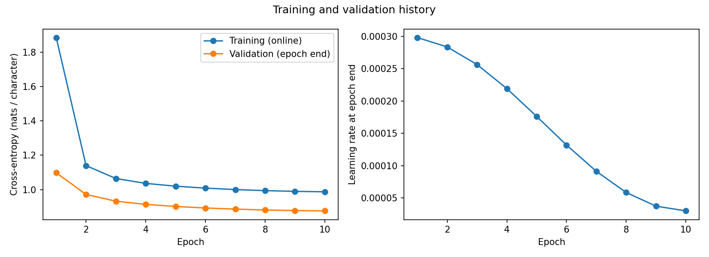

# Yuyao Ding - Task 1 Results

Formal training completed for 10 epochs (54,200 optimizer steps) on the Apple M3 GPU through PyTorch MPS. The checkpoint with the lowest epoch-end validation cross-entropy is epoch 10. Its validation CE is 0.876024 and next-character accuracy is 72.52%.

Run ID: `train_20260914T211231Z_98b2aa86`. This report covers one model configuration and one formal run. Smoke-test results are excluded.

## Architecture and rationale

The decoder-only character model uses learned token and positional embeddings, two pre-normalized Transformer blocks, a final LayerNorm, and an untied linear language-modelling head. Each block contains manually implemented causal multi-head self-attention, LayerNorm, a GELU feed-forward network, and residual connections. No prebuilt Transformer or attention modules are used.

| Setting | Value |
| --- | --- |
| Vocabulary | 104 entries, including `<UNK>` |
| Context length | 256 characters |
| Blocks / attention heads | 2 / 4 |
| Embedding / per-head dimension | 128 / 32 |
| Feed-forward dimension | 512 |
| Dropout / LayerNorm epsilon | 0.1 / 1e-5 |
| Trainable parameters | 456,192 |

This compact configuration limits the cost of a full character-level training run. Four heads divide the 128-dimensional representation evenly, and the feed-forward layer expands it fourfold. Pre-normalization and residual paths support gradient flow; dropout provides regularization. These are design rationales, not measured benefits from ablations. No architecture search was performed, so this configuration is not claimed to be optimal.

See [model configuration](configs/model.json) and [implementation checks](../../reproducibility/manifests/Yuyao_Ding/model_implementation_checks.json).

## Data and preprocessing

Use the original TinyStories `TinyStories-train.txt` and `TinyStories-valid.txt` files. The dataset revision was not pinned to a repository commit; exact input files are identified by SHA-256 checksums in the [preprocessing manifest](../../reproducibility/manifests/Yuyao_Ding/preprocessing_manifest.json).

Interpret the assignment's 100K/10K sizes as **stories**. Independently sample 100,000 training stories with seed 640 and 10,000 validation stories with seed 641, preserving the official split. Reservoir sampling operates over unique parsed stories; selected training-story hashes are excluded from validation. This size-unit interpretation is documented rather than presented as instructor-confirmed.

Read UTF-8 stories using the standalone `<|endoftext|>` delimiter, strip story-edge whitespace, and retain internal case, punctuation and line breaks. Separate stories with two newlines. Build a sorted character vocabulary from training text only, with ID 0 reserved for `<UNK>`. Two validation characters map to `<UNK>`.

| Quantity | Training | Validation |
| --- | ---: | ---: |
| Selected stories | 100,000 | 10,000 |
| Encoded characters | 88,792,995 | 8,693,309 |
| Fixed-length sequences | 346,847 | 33,958 |
| Evaluated target characters | 88,792,832 | 8,693,248 |

Each window contains 257 characters: the first 256 are inputs and the last 256 are shifted targets. Window starts advance by 256, and incomplete tails are discarded. Windows may cross story separators but never cross train-validation boundaries. See [preprocessing configuration](configs/preprocessing.json). No separate test-set result is reported.

## Configuration and training

| Setting | Value |
| --- | --- |
| Model/training seed | 640 |
| Optimizer | AdamW, betas=(0.9, 0.95), weight decay=0.01 |
| Training / evaluation batch size | 64 / 64 |
| Epochs / steps per epoch | 10 / 5,420 |
| Learning rate | Linear warm-up for 2,710 steps to 0.0003, then cosine decay to 0.00003 |
| Gradient clipping | Global L2 norm threshold 1.0 |
| Precision | float32 |
| CPU / training GPU | Apple M3 / Apple M3 GPU (MPS) |
| Python / NumPy / PyTorch | 3.9.7 / 1.23.5 / 2.8.0 |

The learning rate and regularization are initial experimental choices, not tuned optima. Warm-up introduces updates gradually; cosine decay reduces the learning rate later in training. Clipping limits large gradient updates. Ten full epochs meet the minimum duration, with validation loss used to select the checkpoint. See [training configuration](configs/training.json), [run manifest](../../reproducibility/manifests/Yuyao_Ding/train_20260914T211231Z_98b2aa86/manifest.json), and [unaltered raw log](../../reproducibility/raw_logs/Yuyao_Ding/train_20260914T211231Z_98b2aa86.jsonl).

## Evaluation results and definitions

Reload the best checkpoint and evaluate both selected splits in `eval()` mode with dropout disabled. CE is summed negative log-likelihood divided by the number of target characters, including the smaller final batch. Perplexity is `exp(CE)`, BPC is `CE / ln(2)`, and accuracy is correct top-1 next-character predictions divided by target characters. These are character-level, not word-level, metrics.

| Metric | Training | Validation |
| --- | ---: | ---: |
| Cross-entropy (nats/character) | 0.876738 | 0.876024 |
| Perplexity | 2.403047 | 2.401334 |
| Bits-per-character | 1.264865 | 1.263836 |
| Top-1 next-character accuracy | 72.4662% | 72.5176% |

Generalization gap is **validation CE minus training CE = -0.000713435 nats/character**. These nearly equal losses do not show a positive overfitting gap on the selected splits, but they do not establish performance on an unseen test set.

The following training losses are online epoch averages while weights change and dropout is active. Validation uses epoch-end weights with dropout off, so these curves should not be substituted for the matched-checkpoint gap above.

| Epoch | Online training CE | Validation CE |
| --- | ---: | ---: |
| 1 | 1.884536 | 1.097841 |
| 2 | 1.139493 | 0.971652 |
| 3 | 1.064431 | 0.932504 |
| 4 | 1.036062 | 0.913701 |
| 5 | 1.019838 | 0.902067 |
| 6 | 1.008514 | 0.892799 |
| 7 | 1.000124 | 0.886381 |
| 8 | 0.993893 | 0.881114 |
| 9 | 0.989706 | 0.877992 |
| 10 | 0.987156 | 0.876024 |

Source: [saved metrics](outputs/train_20260914T211231Z_98b2aa86/metrics.json) and [epoch history](outputs/train_20260914T211231Z_98b2aa86/history.csv). Full-precision values and evidence paths are in [metrics_report.csv](metrics_report.csv).

## Text generation and diversity

Generate 300 new characters for each of three prompts: `Once upon a time,`, `A little girl found`, and `The dog wanted to`. Use both greedy decoding and temperature sampling at 0.8; sampling seeds are 640, 641, and 642 respectively. Crop context to the latest 256 characters, disable dropout, and suppress `<UNK>`. There is no EOS token, so the character limit determines stopping.

For each method, pool n-grams from its three completions, excluding prompts and never forming n-grams across samples. Distinct-n is `unique n-grams / total n-grams`. Repeated-4 is `(total 4-grams - unique 4-grams) / total 4-grams`. All n-grams are **character-level** and all rates below are fractions.

| Method | Distinct-1 | Distinct-2 | Distinct-3 | Repeated-4 | Generation characters/s |
| --- | ---: | ---: | ---: | ---: | ---: |
| Greedy | 0.037778 | 0.183946 | 0.300895 | 0.624018 | 32.6582 |
| Temperature 0.8 | 0.041111 | 0.258640 | 0.539150 | 0.300786 | 47.8277 |

Generation throughput is total generated characters divided by total measured generation seconds per method (900 characters each), not the mean of per-call rates. All recorded calls are included. The first greedy call took 15.589 seconds, while the other calls took approximately 5.906-6.702 seconds. There was no separate timing warm-up protocol, so these timings do not establish that one decoding method is intrinsically faster. Per-sample rates are retained in the CSV. See [exact samples and timings](outputs/train_20260914T211231Z_98b2aa86/generations_20260914T232627Z_059e7b30.json).

## Training stability and resource usage

The complete raw log contains 54,200 sequential steps and no recorded nonfinite losses or gradient norms. Gradient statistics below are **before clipping**. A maximum above 1.0 is compatible with the configured clipping threshold.

| Measurement | Value |
| --- | ---: |
| Mean / median gradient L2 norm | 0.696585 / 0.617543 |
| Maximum gradient L2 norm | 4.018501 |
| Steps with gradient norm above 1.0 | 3,826 |
| Maximum minibatch CE | 4.662389 |
| Largest within-epoch adjacent minibatch CE increase | 0.108582, at global step 49,483 |
| Loss spikes under the diagnostic rule below | 0 |
| Nonfinite loss / gradient steps | 0 / 0 |
| Training throughput | 118322.7606 target characters/s |
| Training-loop time | 7504.290 seconds (125.072 minutes) |
| Formal-run wall time | 7988.863 seconds (133.148 minutes) |
| Process-lifetime peak RSS | 1,452,556,288 bytes (1.453 GB) |
| Maximum sampled MPS allocated memory | 900,260,352 bytes (0.900 GB) |
| True GPU peak memory | Not measured |

For a reproducible **post-hoc diagnostic**, flag a loss spike when a minibatch CE exceeds twice the median of the preceding 100 minibatches in the same epoch. Exclude the first 100 steps of each epoch. Zero flags under this rule does not mean every smaller fluctuation is absent; the threshold is an analysis choice, not an assignment requirement or a training-time stopping rule.

Training throughput divides 887,928,320 target characters processed across ten epochs by the summed training-loop time. That time includes batch loading, updates and in-loop logging, but excludes validation and checkpoint saving. Formal-run wall time includes epoch evaluation, saving and final best-checkpoint evaluations; it excludes preprocessing and the later text-generation calls.

RSS is the process-lifetime high-water mark and can include earlier notebook work. MPS memory is the maximum of sampled allocated-memory observations, not the true device peak or total unified-memory usage. The two memory values overlap in scope and must not be added. GB uses 1,000,000,000 bytes. The unavailable true GPU peak is explicitly marked `not_measured` in the CSV.

## Failure analysis, comparison and limitations

The three cases in [failure_analysis.md](failure_analysis.md) document repetition, broken grammar and loss of coherence. Temperature sampling has higher diversity and lower repeated-4 rate in these samples, but grammatical and narrative errors remain. Six short outputs do not support broad quality claims, and character accuracy does not measure story quality.

Only one architecture and one training seed were run formally. Architecture, hyperparameter and teammate comparisons are not measured here. Small capacity and a 256-character context are plausible constraints, but their effects were not isolated experimentally. Validation was used for checkpoint selection, and no held-out test score or confidence interval is claimed.

## Reproducibility and artifact identity

- Code and executed outputs: [task1_llm.ipynb](src/task1_llm.ipynb).
- Best checkpoint: `checkpoints/train_20260914T211231Z_98b2aa86/epoch_010.pt` (local, excluded from Git).
- Checkpoint SHA-256: `23933799df14748236f4a89d726f347a41485ba1885a9a654916d5be51c2eac6`.
- Checkpoint mapping: [best.json](outputs/train_20260914T211231Z_98b2aa86/best.json). Configurations, data fingerprints, hardware and log location are in the [run manifest](../../reproducibility/manifests/Yuyao_Ding/train_20260914T211231Z_98b2aa86/manifest.json).
- The manifest code hash reflects the saved notebook with `RUN_FORMAL_TRAINING=False`; the executed notebook enabled it. Review identified that switch as the sole code difference. The historical manifest and raw log are preserved, and this source-snapshot limitation is disclosed.

These reports summarize saved experiment evidence and recompute log/generation aggregates. Preparing them did not rerun training or full model evaluation. Raw data, processed arrays and checkpoints remain local; remote checkpoint backup is not established by this report.
