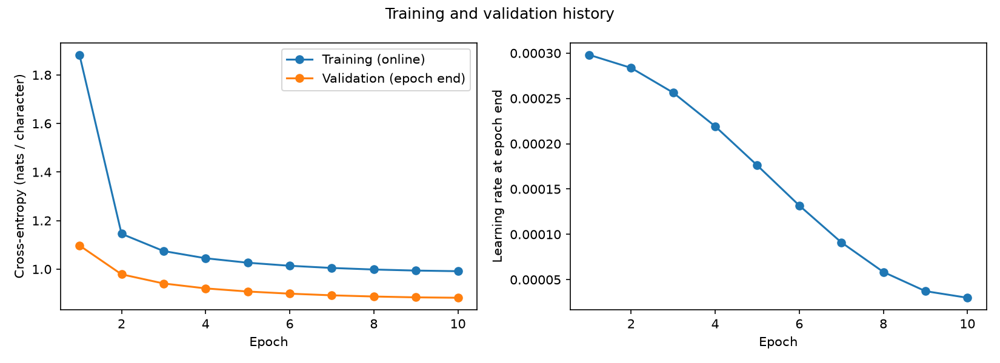

# Yuyao Ding - Task 1 Results

Formal training completed for 10 epochs (54,200 optimizer steps) on an NVIDIA GeForce RTX 4090 through PyTorch CUDA. The checkpoint with the lowest epoch-end validation cross-entropy is epoch 10. Its validation CE is 0.882114 and next-character accuracy is 72.31%.

Run ID: `train_20260927T000510Z_b9df2210`. This is the main reported run. The earlier Mac run is retained as a comparison below; smoke-test results are excluded.

## Architecture and rationale

The decoder-only character model uses learned token and positional embeddings, two pre-normalized Transformer blocks, a final LayerNorm, and an untied linear language-modelling head. Each block contains manually implemented causal multi-head self-attention, LayerNorm, a GELU feed-forward network, and residual connections. No prebuilt Transformer or attention modules are used.

| Setting | Value |
| --- | --- |
| Vocabulary | 104 entries, including `<UNK>` |
| Context length | 256 characters |
| Blocks / attention heads | 2 / 4 |
| Embedding / per-head dimension | 128 / 32 |
| Feed-forward dimension | 512 |
| Dropout / LayerNorm epsilon | 0.1 / 1e-5 |
| Trainable parameters | 456,192 |

This compact configuration limits the cost of a full character-level training run. Four heads divide the 128-dimensional representation evenly, and the feed-forward layer expands it fourfold. Pre-normalization and residual paths support gradient flow; dropout provides regularization. These are design rationales, not measured benefits from ablations. No architecture search was performed, so this configuration is not claimed to be optimal.

See [model configuration](configs/model.json) and [implementation checks](../../reproducibility/manifests/Yuyao_Ding/model_implementation_checks.json).

## Data and preprocessing

Use the original TinyStories `TinyStories-train.txt` and `TinyStories-valid.txt` files. The dataset revision was not pinned to a repository commit; exact input files are identified by SHA-256 checksums in the [preprocessing manifest](../../reproducibility/manifests/Yuyao_Ding/preprocessing_manifest.json).

Interpret the assignment's 100K/10K sizes as **stories**. Independently sample 100,000 training stories with seed 640 and 10,000 validation stories with seed 641, preserving the official split. Reservoir sampling operates over unique parsed stories; selected training-story hashes are excluded from validation. This size-unit interpretation is documented rather than presented as instructor-confirmed.

Read UTF-8 stories using the standalone `<|endoftext|>` delimiter, strip story-edge whitespace, and retain internal case, punctuation and line breaks. Separate stories with two newlines. Build a sorted character vocabulary from training text only, with ID 0 reserved for `<UNK>`. Two validation characters map to `<UNK>`.

| Quantity | Training | Validation |
| --- | ---: | ---: |
| Selected stories | 100,000 | 10,000 |
| Encoded characters | 88,792,995 | 8,693,309 |
| Fixed-length sequences | 346,847 | 33,958 |
| Evaluated target characters | 88,792,832 | 8,693,248 |

Each window contains 257 characters: the first 256 are inputs and the last 256 are shifted targets. Window starts advance by 256, and incomplete tails are discarded. Windows may cross story separators but never cross train-validation boundaries. See [preprocessing configuration](configs/preprocessing.json). No separate test-set result is reported.

## Configuration and training

| Setting | Value |
| --- | --- |
| Model/training seed | 640 |
| Optimizer | AdamW, betas=(0.9, 0.95), weight decay=0.01 |
| Training / evaluation batch size | 64 / 64 |
| Epochs / steps per epoch | 10 / 5,420 |
| Learning rate | Linear warm-up for 2,710 steps to 0.0003, then cosine decay to 0.00003 |
| Gradient clipping | Global L2 norm threshold 1.0 |
| Precision | float32 |
| CPU / training GPU | Intel Core i9-14900KF / NVIDIA GeForce RTX 4090 (CUDA) |
| Python / NumPy / PyTorch | 3.12.14 / 2.5.3 / 2.8.0+cu128 |

The learning rate and regularization are initial experimental choices, not tuned optima. Warm-up introduces updates gradually; cosine decay reduces the learning rate later in training. Clipping limits large gradient updates. Ten full epochs meet the minimum duration, with validation loss used to select the checkpoint. See [training configuration](configs/training.json), [run manifest](../../reproducibility/manifests/Yuyao_Ding/train_20260927T000510Z_b9df2210/manifest.json), and [unaltered raw log](../../reproducibility/raw_logs/Yuyao_Ding/train_20260927T000510Z_b9df2210.jsonl).

## Evaluation results and definitions

Reload the best checkpoint and evaluate both selected splits in `eval()` mode with dropout disabled. CE is summed negative log-likelihood divided by the number of target characters, including the smaller final batch. Perplexity is `exp(CE)`, BPC is `CE / ln(2)`, and accuracy is correct top-1 next-character predictions divided by target characters. These are character-level, not word-level, metrics.

| Metric | Training | Validation |
| --- | ---: | ---: |
| Cross-entropy (nats/character) | 0.882596 | 0.882114 |
| Perplexity | 2.417166 | 2.416001 |
| Bits-per-character | 1.273317 | 1.272621 |
| Top-1 next-character accuracy | 72.2687% | 72.3116% |

Generalization gap is **validation CE minus training CE = -0.000482382 nats/character**. These nearly equal losses do not show a positive overfitting gap on the selected splits, but they do not establish performance on an unseen test set.

The following training losses are online epoch averages while weights change and dropout is active. Validation uses epoch-end weights with dropout off, so these curves should not be substituted for the matched-checkpoint gap above.

| Epoch | Online training CE | Validation CE |
| --- | ---: | ---: |
| 1 | 1.882997 | 1.097462 |
| 2 | 1.145520 | 0.978702 |
| 3 | 1.074590 | 0.940973 |
| 4 | 1.044882 | 0.920698 |
| 5 | 1.026471 | 0.907885 |
| 6 | 1.013883 | 0.899014 |
| 7 | 1.004897 | 0.892192 |
| 8 | 0.998467 | 0.887282 |
| 9 | 0.994136 | 0.883779 |
| 10 | 0.991578 | 0.882114 |

Validation loss improves in every epoch, with smaller improvements near the end. This is consistent with the run approaching a plateau under its learning-rate schedule; it does not establish that further training would have no benefit.

Source: [saved metrics](outputs/train_20260927T000510Z_b9df2210/metrics.json) and [epoch history](outputs/train_20260927T000510Z_b9df2210/history.csv). Full-precision values and evidence paths are in [metrics_report.csv](metrics_report.csv). Filter `model_id` to the run ID above for this report; the CSV also retains the historical Mac rows.

## Text generation and diversity

Generate 300 new characters for each of three prompts: `Once upon a time,`, `A little girl found`, and `The dog wanted to`. Use both greedy decoding and temperature sampling at 0.8; sampling seeds are 640, 641, and 642 respectively. Crop context to the latest 256 characters, disable dropout, and suppress `<UNK>`. There is no EOS token, so the character limit determines stopping.

For each method, pool n-grams from its three completions, excluding prompts and never forming n-grams across samples. Distinct-n is `unique n-grams / total n-grams`. Repeated-4 is `(total 4-grams - unique 4-grams) / total 4-grams`. All n-grams are **character-level** and all rates below are fractions.

| Method | Distinct-1 | Distinct-2 | Distinct-3 | Repeated-4 | Generation characters/s |
| --- | ---: | ---: | ---: | ---: | ---: |
| Greedy | 0.038889 | 0.189521 | 0.300895 | 0.630752 | 271.9974 |
| Temperature 0.8 | 0.045556 | 0.269788 | 0.564877 | 0.267116 | 247.3769 |

Generation throughput is total generated characters divided by total measured generation seconds per method (900 characters each), not the mean of per-call rates. All recorded calls are included: 3.308855 seconds for greedy and 3.638173 seconds for temperature sampling. There was no separate timing warm-up protocol, so these timings do not establish that one decoding method is intrinsically faster. Per-sample rates are retained in the CSV. See [exact samples and timings](outputs/train_20260927T000510Z_b9df2210/generations_20260927T002606Z_9466d7d0.json).

## Training stability and resource usage

The complete raw log contains 54,200 sequential steps and no recorded nonfinite losses or gradient norms. Gradient statistics below are **before clipping**. A maximum above 1.0 is compatible with the configured clipping threshold.

| Measurement | Value |
| --- | ---: |
| Mean / median gradient L2 norm | 0.715206 / 0.637479 |
| Maximum gradient L2 norm | 4.003296 |
| Steps with gradient norm above 1.0 | 3,922 |
| Maximum minibatch CE | 4.661563 |
| Largest within-epoch adjacent minibatch CE increase | 0.114905, at global step 49,483 |
| Loss spikes under the diagnostic rule below | 0 |
| Nonfinite loss / gradient steps | 0 / 0 |
| Training throughput | 746664.1530 target characters/s |
| Training-loop time | 1189.194 seconds (19.820 minutes) |
| Formal-run wall time | 1247.819 seconds (20.797 minutes) |
| Process-lifetime peak RSS | 2,362,290,176 bytes (2.362 GB) |
| Peak PyTorch CUDA allocated memory | 750,842,880 bytes (0.751 GB) |
| Total-device GPU peak memory | Not measured |

For a reproducible **post-hoc diagnostic**, flag a loss spike when a minibatch CE exceeds twice the median of the preceding 100 minibatches in the same epoch. Exclude the first 100 steps of each epoch. Zero flags under this rule does not mean every smaller fluctuation is absent; the threshold is an analysis choice, not an assignment requirement or a training-time stopping rule.

Training throughput divides 887,928,320 target characters processed across ten epochs by the summed training-loop time. That time includes batch loading, updates and in-loop logging, but excludes validation and checkpoint saving. Formal-run wall time includes epoch evaluation, saving and final best-checkpoint evaluations; it excludes preprocessing and the later text-generation calls.

RSS is the process-lifetime high-water mark and can include earlier notebook work. CUDA memory is the peak tensor allocation reported by `torch.cuda.max_memory_allocated`, not allocator-reserved memory or total device usage. It is not directly comparable with the sampled MPS allocation in the historical run. GB uses 1,000,000,000 bytes.

The CPU model was checked in the Windows registry during report preparation. The original run manifest retains its recorded platform identifier. Recomputed statistics and input checksums are in [report_audit.json](outputs/train_20260927T000510Z_b9df2210/report_audit.json).

## Failure analysis, comparison and limitations

The three cases in [failure_analysis.md](failure_analysis.md) document repetition, broken grammar and loss of coherence. Temperature sampling has higher diversity and lower repeated-4 rate in these samples, but grammatical and narrative errors remain. Six short outputs do not support broad quality claims, and character accuracy does not measure story quality.

| Measurement | RTX 4090 (reported run) | Apple M3 (historical run) |
| --- | ---: | ---: |
| Validation CE | 0.882114 | 0.876024 |
| Validation perplexity | 2.416001 | 2.401334 |
| Validation next-character accuracy | 72.3116% | 72.5176% |
| Formal-run wall time (minutes) | 20.797 | 133.148 |

The earlier run is `train_20260914T211231Z_98b2aa86`; its [metrics](outputs/train_20260914T211231Z_98b2aa86/metrics.json), [manifest](../../reproducibility/manifests/Yuyao_Ding/train_20260914T211231Z_98b2aa86/manifest.json) and raw log are retained. The saved model/training configurations and preprocessing hashes match across runs. The Windows run is 6.40 times faster in measured wall time, with slightly higher validation CE and 0.21 percentage points lower accuracy. This comparison does not show a quality improvement from the faster GPU.

This is not a controlled hardware-only experiment: software environments differ, the current source includes portability fixes, and the exact historical Mac source snapshot is unavailable. The Mac weights are also absent from this copy. The main report therefore uses the locally available RTX 4090 checkpoint and its matching saved source.

Only one architecture and one training seed were used in these two formal runs. Architecture, hyperparameter and teammate comparisons are not measured here. Small capacity and a 256-character context are plausible constraints, but their effects were not isolated experimentally. Validation was used for checkpoint selection, and no held-out test score or confidence interval is claimed.

## Reproducibility and artifact identity

- Code and executed outputs: [task1_llm.ipynb](src/task1_llm.ipynb).
- Best checkpoint: `checkpoints/train_20260927T000510Z_b9df2210/epoch_010.pt` (local, excluded from ordinary Git commits).
- Checkpoint SHA-256: `5cde3d36c7cb5b29224e19644e50be952a97c0e440c4cc3199169d6a2c8518ef`.
- Checkpoint mapping: [best.json](outputs/train_20260927T000510Z_b9df2210/best.json). Configurations, data fingerprints, hardware and log location are in the [run manifest](../../reproducibility/manifests/Yuyao_Ding/train_20260927T000510Z_b9df2210/manifest.json).
- Training source: [source_snapshot.py](../../reproducibility/manifests/Yuyao_Ding/train_20260927T000510Z_b9df2210/source_snapshot.py). Notebook code cells are unchanged; only the failure-analysis Markdown was updated after training. The executed outputs belong to the reported RTX 4090 run.
- Setup, direct checkpoint demo and restore instructions: [README.md](README.md).

These reports summarize saved experiment evidence and recompute log/generation aggregates. Preparing them did not rerun training or full model evaluation. Raw data, processed arrays and checkpoints are excluded from ordinary Git commits. The combined resource ZIP includes the saved checkpoint and reproduction materials. Historical logs and run manifests are unchanged.

## References

- Vaswani et al. (2017). [Attention Is All You Need](https://arxiv.org/abs/1706.03762).
- Eldan and Li (2023). [TinyStories: How Small Can Language Models Be and Still Speak Coherent English?](https://arxiv.org/abs/2305.07759).
