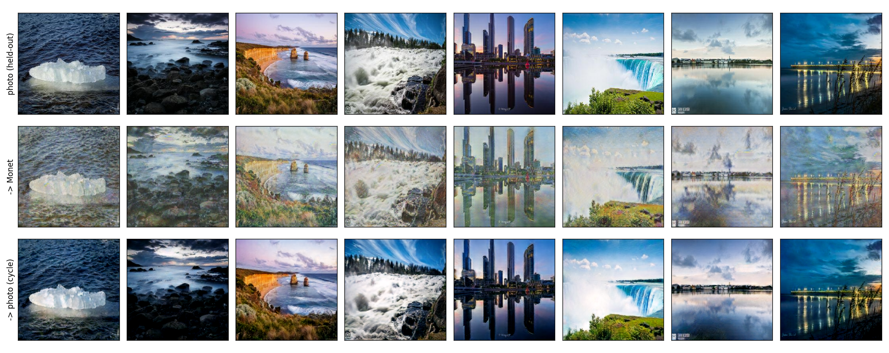

# Task 3: Pratiksha Kaushik (CycleGAN, Monet ↔ Photo)

Unpaired image-to-image translation between Monet paintings and photos, using a CycleGAN trained from scratch. Pretrained networks are used only inside the metrics: Inception-v3 for FID/KID and AlexNet for LPIPS.

Personal parameters: `SID4=9002 | SEED=9002 | SLICE=2 | HP_ID=2 | CLS_A=2 | CLS_B=3`. All runs used an NVIDIA RTX 4090 (Python 3.10, torch 2.1.2).

## Final result

| Model | Photo→Monet FID | Monet→Photo FID | Submitted FID | Submitted MiFID | Score (FID+MiFID)/2 ↓ |
|---|---|---|---|---|---|
| v1 (baseline) | 101.51 | 102.99 | 102.25 | 0.4168 | 51.33 |
| **v3 (final)** | **100.54** | **99.58** | **100.06** | **0.4135** | **50.24** |

These scores come from the course evaluation script, using the first 300 files in each direction. See [results.md](results.md) for the full write-up.



All figures: [outputs/figures/](outputs/figures/README.md), also on [Google Drive](https://drive.google.com/drive/folders/1EXP4Iq-KOcFrWSmeZKD6gqnB6YQxDPTH).

## Two model versions

| | v1 (baseline) | v3 (final) |
|---|---|---|
| Notebook | [src/task3_cyclegan_v1_baseline.ipynb](src/task3_cyclegan_v1_baseline.ipynb) | [src/Pratiksha_cyclegan_monet_v3.ipynb](src/Pratiksha_cyclegan_monet_v3.ipynb) |
| Generator | ResNet, 9 blocks (11.38M) | same |
| Discriminator | 70×70 PatchGAN, 1 scale | PatchGAN at **2 scales** |
| Loss | LSGAN + 10·cycle + 5·identity | LSGAN + 10·cycle + **1**·identity |
| Training | 50 epochs / 40k steps, batch 4 | 80 epochs / 64k steps, batch 4 |
| Weights used | EMA, epoch 45 | EMA averaged over epochs 60/65/70 |
| Post-processing | none | colour calibration (Monet→photo only) |
| Official 300 photos in training | yes | no (excluded, so there's no leakage) |

Both versions use DiffAugment (colour + translation), an image pool of 50, EMA weights (decay 0.999) and bf16.

v3 settings came from a 15-epoch screening of 4 configurations. The 2-scale discriminator was the change that helped: `ms_id1` beat the base by 1.37 points.

## Folder layout

```
Pratiksha_Kaushik/
├── README.md                     this file
├── results.md                    main write-up: v1 vs v3, screening, per-epoch scores, metrics, stability, efficiency
├── failure_analysis.md           7 failure categories for v3 (night scenes, skies, fine texture, steganography...)
├── full_metrics_report.csv       every required metric, v1 vs v3 side by side (audit + Kaggle rows still PENDING)
├── metrics_v1.md                 metrics written by the v1 notebook (v1 only)
├── evaluate_local.py             course evaluation script as a .py (FID + MiFID on pred_A2B / pred_B2A)
├── submission.csv                final v3 submission, exactly as written by the v3 notebook (FID 100.0568, MiFID 0.4135, score 50.2351)
├── RUN_LOG.txt                   raw v3 log: screening, final run, evaluation, export
├── reproducibility_manifest.json hardware, versions, data split, run info, sha256 of every file
├── configs/
│   ├── config_base.json          base config (v1 settings; the notebook overrides lambda_id / n_scales per run)
│   ├── config_v3_final.json      exact config of the final v3 run (taken from the checkpoint)
│   └── metrics_v1.json           v1 metrics + stability stats
├── src/
│   ├── Pratiksha_cyclegan_monet_v3.ipynb   final notebook (sections 0-19)
│   ├── task3_cyclegan_v1_baseline.ipynb    v1 baseline notebook
│   ├── cyclegan_models.py        generator / discriminator classes + checkpoint loader
│   ├── full_metrics.py           FID, KID, P/R, density/coverage, content cosine, LPIPS, cycle L1
│   └── score_human_audit.py      rater means, agreement, Cohen's kappa
├── checkpoints/                  (git-ignored; download from Google Drive, link below)
│   ├── last_v3_epoch80.pt        full v3 training state at epoch 80 (514 MB)
│   └── best_ema_v1_epoch45.pt    v1 EMA generators, epoch 45 (91 MB)
├── data_processed/               (git-ignored)
│   ├── train_history_v3.csv      per-step losses, gradient norms, D outputs (64,000 steps)
│   └── train_history_v1.csv      same for v1 (40,000 steps)
└── outputs/
    ├── eval_history_v3.csv       validation FID / MiFID / score every 5 epochs
    ├── eval_history_v1.csv       v1 FID every 5 epochs
    ├── figures/                  data samples, loss + stability curves, translations with cycle reconstructions, worst cases (also on Google Drive, link in figures/README.md)
    ├── human_audit/              30-sample blinded audit: images/, audit_sheet.html, rater1/2.csv, _key.csv
    ├── pred_A2B/                 Monet -> photo predictions (300), Google Drive link in README.md
    └── pred_B2A/                 photo -> Monet predictions (7,038), Google Drive link in README.md
```

## Checkpoints

The `.pt` files are too large for the repo. Download them from Google Drive and put them in `checkpoints/`:

**https://drive.google.com/drive/folders/1CGzq0IoI6pX0s4msiYyyfpYXTPhZJhHp**

| File | What it is |
|---|---|
| `last_v3_epoch80.pt` | full v3 training state at epoch 80 (generators, discriminators, EMA, optimizers, history, config), 514 MB |
| `best_ema_v1_epoch45.pt` | v1 baseline EMA generators at epoch 45, 91 MB |

## Notebook walkthrough (v3)

1. **Setup:** personal params, dataset discovery (`monet_jpg/`, `photo_jpg/`), run log, config.
2. **Data:** 300 Monets, 7,038 photos, split into 5,772 train / 1,000 held-out. The 300 official photos are excluded.
3. **Model:** ResNet generator, multi-scale PatchGAN, DiffAugment, image pool, EMA, losses.
4. **Metrics:** a copy of the course FID/MiFID script, plus a separate validation set for checkpoint selection.
5. **Training:** 5a screening (4 configs × 15 epochs), then 5b the final 80-epoch run.
6. **Training behaviour and checkpoint selection:** the score plateaus after epoch 60, so epochs 60/65/70 are averaged.
7. **Colour calibration:** global colour correction for Monet→photo.
8. **Evaluation:** FID, KID, precision/recall, density/coverage, content cosine, LPIPS, cycle L1, memorisation.
9. **Qualitative results, cycle-consistency checks** (all PASS), **error analysis** and **efficiency**.
10. **Export:** predictions, official score, blinded human audit packet, METRICS.md, then a copy into the repo.

## Reproduce

1. Put the Kaggle "I'm Something of a Painter Myself" data (`monet_jpg/`, `photo_jpg/`) under the notebook's data root. It was `/app/content` on the training machine.
2. Open `src/Pratiksha_cyclegan_monet_v3.ipynb` and run it top to bottom with `QUICK=False`. A full run, including screening, takes about 6 h on an RTX 4090. The final run alone takes about 3.2 h.
3. With `resume=true`, training resumes from `runs/<name>/checkpoints/last.pt` under the output folder if it exists. To restart from the copy in this repo, put `checkpoints/last_v3_epoch80.pt` there as `last.pt`.

## Commands

```bash
# course score from the prediction folders
python evaluate_local.py --root /app/content/data266_cyclegan_v3 --monet /app/content/monet_jpg --photo /app/content/photo_jpg

# full metric set for a checkpoint
python src/full_metrics.py --ckpt checkpoints/last_v3_epoch80.pt --monet /app/content/monet_jpg --photo /app/content/photo_jpg

# human audit, after both raters fill their sheets
python src/score_human_audit.py
```

Extra packages for the metrics: `torch-fidelity`, `lpips`, `scipy`, `pandas`, `pillow`.

## Still to do before submission

- **Human audit:** two people need to fill `outputs/human_audit/rater1.csv` and `rater2.csv` independently, using `audit_sheet.html` to view the images. Then run `src/score_human_audit.py` and copy the numbers into `results.md` section 9.
- **Kaggle:** submit, then add the public score, private score (if shown) and rank to `results.md` section 10 and `full_metrics_report.csv`. Put a leaderboard screenshot in `outputs/kaggle/`.
- **Final v3 weights:** `best_ema.pt` (the 60/65/70 average) and `color_cal.pt` from `/app/content/data266_cyclegan_v3/runs/final/checkpoints/` are not in this folder yet. `last_v3_epoch80.pt` is the epoch-80 state, not the averaged model.
