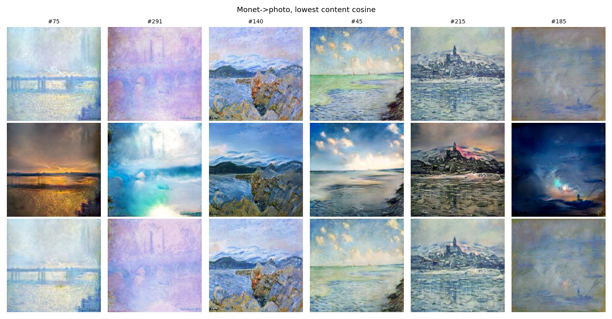

# Figures - Task 3 (Pratiksha Kaushik)

Full-resolution figures are also on Google Drive:

**Drive folder:** https://drive.google.com/drive/folders/1EXP4Iq-KOcFrWSmeZKD6gqnB6YQxDPTH

All figures come from the final v3 notebook (`src/Pratiksha_cyclegan_monet_v3.ipynb`).

| File | What it shows |
|---|---|
| `data_monet.png`, `data_photo.png` | Sample training images from each domain |
| `loss_curves.png` | Generator, discriminator, cycle and identity losses over 64,000 steps |
| `stability_curves.png` | Gradient norms and discriminator outputs over training |
| `qual_photo2monet.png` | Photo → Monet: input, translation, cycle reconstruction |
| `qual_monet2photo.png` | Monet → Photo: input, translation, cycle reconstruction |
| `worst_content_p2m.png` | Photo → Monet cases with the lowest content similarity |
| `worst_cycle_p2m.png` | Photo → Monet cases with the worst cycle reconstruction |
| `worst_content_m2p.png` | Monet → Photo cases with the lowest content similarity |

## Loss and stability

## Translations and cycle reconstructions

## Worst cases

