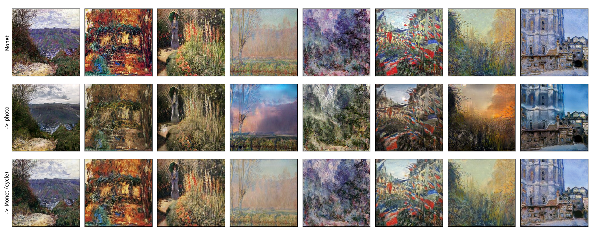
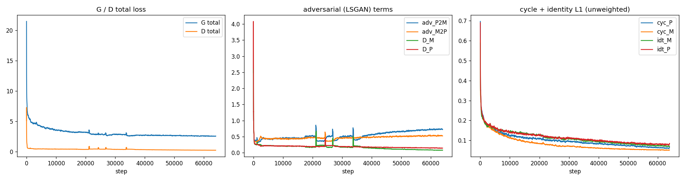
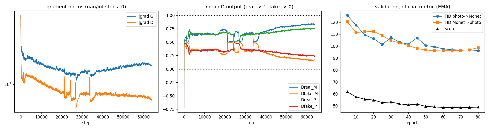

# Results: CycleGAN Monet ↔ Photo

SID4=9002 | SEED=9002 | SLICE=2 | HP_ID=2 | CLS_A=2 | CLS_B=3 | GPU: NVIDIA GeForce RTX 4090

All networks were trained from scratch. Pretrained networks are used only inside the evaluation metrics: Inception-v3 for FID/KID, AlexNet for LPIPS.

## 1. Final result (course evaluation script)

Scored on the first 300 files by name in each folder, both directions, with torchvision Inception-v3. Score = (FID + MiFID) / 2, lower is better.

| Model | Photo→Monet FID | Monet→Photo FID | Photo→Monet MiFID | Monet→Photo MiFID | Submitted FID | Submitted MiFID | **Score** |
|---|---|---|---|---|---|---|---|
| v1 (baseline) | 101.512 | 102.989 | 0.4127 | 0.4208 | 102.2502 | 0.4168 | 51.3335 |
| **v3 (final)** | **100.538** | **99.576** | **0.4099** | **0.4170** | **100.0568** | **0.4135** | **50.2351** |

Course-format file from the v3 notebook (section 15): `final_submission.csv` (uploaded to Kaggle as `submission.csv`). This is the file submitted to Kaggle (score −50.2351, see section 10).

```
ID,FID,MiFID
1,100.05676111548,0.41345334997946315
```

## 2. Models

| | v1 (baseline) | v3 (final) |
|---|---|---|
| Generators | ResNet, 9 residual blocks (11.38M each) | same |
| Discriminators | 70×70 PatchGAN, 1 scale (2.76M each) | PatchGAN at 2 scales (5.53M each) |
| Losses | LSGAN + 10·cycle + 5·identity | LSGAN + 10·cycle + **1**·identity |
| Training | 50 epochs (40,000 steps), batch 4 | 80 epochs (64,000 steps), batch 4 |
| LR schedule | 2e-4 constant 25 epochs, then linear decay | 2e-4 constant 40 epochs, then linear decay |
| Model used | EMA weights, epoch 45 | EMA weights averaged over epochs 60, 65, 70 |
| Post-processing | none | global colour calibration, Monet→photo only |
| Checkpoint selection | photo→Monet FID on held-out photos | course metric, both directions, on a separate validation set |
| Official 300 photos in training | yes (~86%) | no (excluded) |

Both use DiffAugment (colour + translation) on discriminator inputs, an image pool of 50, EMA generator weights (decay 0.999) and bf16 mixed precision.

## 3. Screening (v3): which setting works best

15 epochs each (10 constant + 5 decay), same seed, scored with the course metric on the validation set.

| Config | λ_cyc | λ_id | D scales | Photo→Monet FID | Monet→Photo FID | MiFID | Score |
|---|---|---|---|---|---|---|---|
| **ms_id1** | 10 | 1 | 2 | 104.525 | 111.655 | 0.422 | **54.256** |
| ms_cyc5_id1 | 5 | 1 | 2 | 104.220 | 114.071 | 0.423 | 54.785 |
| base (v1 settings) | 10 | 5 | 1 | 112.131 | 109.527 | 0.427 | 55.628 |
| id1 | 10 | 1 | 1 | 109.945 | 113.684 | 0.426 | 56.120 |

The winner had to beat `base` by at least 1 point; `ms_id1` did, by 1.37. The second discriminator scale is what helped: photo→Monet FID was about 104 versus 110–112. Lowering λ_id alone made things slightly worse.

## 4. Final run (v3): validation score per checkpoint

| Epoch | Photo→Monet FID | Monet→Photo FID | FID | MiFID | Score |
|---|---|---|---|---|---|
| 5 | 125.80 | 120.36 | 123.08 | 0.4225 | 61.75 |
| 15 | 109.35 | 111.96 | 110.66 | 0.4203 | 55.54 |
| 25 | 101.35 | 108.97 | 105.16 | 0.4198 | 52.79 |
| 35 | 103.23 | 102.61 | 102.92 | 0.4199 | 51.67 |
| 40 | 101.65 | 100.63 | 101.14 | 0.4179 | 50.78 |
| 50 | 100.51 | 96.74 | 98.63 | 0.4157 | 49.52 |
| 60 | 97.62 | 95.98 | 96.80 | 0.4149 | 48.61 |
| 65 | 97.07 | 96.47 | 96.77 | 0.4155 | 48.59 |
| **70** | **96.60** | **96.42** | **96.51** | **0.4150** | **48.46** |
| 75 | 96.83 | 96.90 | 96.86 | 0.4143 | 48.64 |
| 80 | 96.28 | 98.71 | 97.50 | 0.4146 | 48.96 |
| **avg 60/65/70** | 96.74 | 95.57 | 96.15 | 0.4146 | **48.28** |
| + colour calibration (Monet→photo) | 96.74 | 94.98 | n/a | n/a | **48.14** |

The score plateaus after epoch 60, and the last 10 epochs slightly worsen it. Validation scores are on held-out photos, not the 300 the course script scores, which is why the official score (50.24) is about 2 points higher.

## 5. Evaluation metrics

Held-out photos (1,000) vs the 300 Monets; FID-standard Inception-v3, 2048-d features.

| Metric | Direction | v1 | **v3** |
|---|---|---|---|
| FID ↓ | Photo→Monet | 94.67 | **93.22** |
| | Monet→Photo | 86.15 | **85.95** |
| KID ×10³ ↓ | Photo→Monet | **19.48 ± 2.06** | 20.63 ± 2.06 |
| | Monet→Photo | **18.55 ± 2.08** | 19.51 ± 2.20 |
| Precision ↑ | Photo→Monet | 0.432 | **0.483** |
| | Monet→Photo | 0.683 | **0.713** |
| Recall ↑ | Photo→Monet | **0.657** | 0.590 |
| | Monet→Photo | **0.450** | 0.436 |
| Density ↑ | Photo→Monet | 0.316 | **0.408** |
| | Monet→Photo | **0.730** | 0.719 |
| Coverage ↑ | Photo→Monet | 0.790 | **0.837** |
| | Monet→Photo | **0.454** | 0.451 |
| Content cosine ↑ | Photo→Monet | **0.766** | 0.734 |
| | Monet→Photo | **0.816** | 0.785 |
| LPIPS input vs translation | Photo→Monet | 0.372 | 0.389 |
| | Monet→Photo | 0.302 | 0.348 |
| Cycle reconstruction L1 ↓ | Photo cycle | **0.093** | 0.117 |
| | Monet cycle | **0.068** | 0.073 |
| LPIPS input vs reconstruction ↓ | Photo cycle | **0.208** | 0.210 |
| | Monet cycle | **0.274** | 0.287 |
| Memorisation distance (nearest real, cosine) | Photo→Monet | 0.261 | 0.255 |

**Reference points:**
- FID between two halves of real held-out photos: 57.32.
- Unrelated-pair baselines: L1 0.574, LPIPS 0.811, content cosine 0.569.
- A memorisation distance above 0.1 means generated images aren't copies of training Monets.

v3 makes more convincing Monets (higher precision, density and coverage, lower FID). It changes the input more strongly, so content cosine is a bit lower and cycle L1 a bit higher, the expected effect of the weaker identity loss.

## 6. Cycle-consistency checks (v3)

| Check | Result |
|---|---|
| Generator preserves shape | PASS |
| Output in [-1, 1] | PASS |
| Cycle loss reaches G_P2M | PASS |
| Cycle loss reaches G_M2P | PASS |
| Identity loss isolated to its own generator | PASS |
| Photo-cycle L1 < 0.5 × unrelated baseline | PASS (0.117 vs 0.574) |
| Monet-cycle L1 < 0.5 × unrelated baseline | PASS (0.073 vs 0.574) |
| Photo-cycle L1 < L1(input, translation) | PASS |
| Cycle loss decreased during training | PASS (0.280 → 0.122) |

**Translations and cycle reconstructions** (rows: input, translation, reconstruction):




## 7. Training losses and stability

Means over the last 25% of steps.

| | v1 | v3 |
|---|---|---|
| Discriminator total | 0.326 | 0.245 |
| Generator adversarial (both) | 0.973 | 1.214 |
| Cycle L1, unweighted (first 25% → last 25%) | 0.299 → 0.126 | 0.280 → 0.122 |
| Identity L1, unweighted | 0.111 | 0.161 |
| λ_cyc / λ_id | 10 / 5 | 10 / 1 |
| Grad-norm G (median / p99 / max) | 21.7 / 53.2 / 198.3 | 16.3 / 33.7 / 146.8 |
| Grad-norm D (median / p99 / max) | 11.8 / 31.4 / 245.9 | 7.3 / 18.8 / 434.9 |
| NaN/Inf steps | 0 of 40,000 | 0 of 64,000 |

**What this shows for v3:**
- **Stable training:** no NaN steps, bounded gradients, and only rare isolated spikes.
- **Late imbalance:** in the last ~20 epochs the discriminator loss kept falling (≈0.36 at epoch 40 → 0.22 at epoch 80) while the validation score stopped improving. The discriminators began to dominate, so checkpoints from epochs 60–70 were averaged instead of using the last one.





## 8. Efficiency

| | v1 | v3 |
|---|---|---|
| Parameters, generator / discriminator | 11.38M / 2.76M | 11.38M / 5.53M |
| Parameters, total | 28.29M | 33.82M |
| Training time | 1.83 h (40,000 steps) | 3.20 h (64,000 steps) |
| Training throughput | 24.2 img/s per domain | 22.2 img/s per domain |
| Inference throughput (batch 16, median of 5) | 523.8 ± 4.7 img/s | 505.3 ± 19.3 img/s |
| Peak GPU memory, train / inference | 18.51 GB / 2.44 GB | 6.33 GB / 2.99 GB |

## 9. Human audit (30 fixed samples, 2 raters)

The blinded audit packet is in `outputs/human_audit/`: 30 side-by-side images (20 photo→Monet, 10 Monet→photo) in shuffled order, `audit_sheet.html` for viewing, and one sheet per rater. Each rater scores style, content preservation and artifacts from 1 to 5, on their own.

| Criterion | Rater 1 mean | Rater 2 mean | Both | Exact agreement | Within ±1 | Cohen's kappa | Quadratic-weighted kappa |
|---|---|---|---|---|---|---|---|
| Style | 3.50 | 3.53 | 3.52 | 50% | 100% | 0.23 | 0.60 |
| Content | 3.93 | 3.93 | 3.93 | 60% | 100% | 0.29 | 0.49 |
| Artifacts | 3.10 | 2.93 | 3.02 | 50% | 100% | 0.22 | 0.52 |

**Overall human-audit score: 3.49 / 5** (mean of all three criteria, both raters).

| Direction | Style | Content | Artifacts |
|---|---|---|---|
| Photo → Monet (20 samples) | 3.40 | 3.78 | 2.80 |
| Monet → Photo (10 samples) | 3.75 | 4.25 | 3.45 |

**Reading the numbers:**
- **Content preservation is the strongest criterion (3.93).** Both raters agreed the scene layout is usually kept. This matches the content cosine of 0.73-0.79.
- **Artifacts are the weakest (3.02).** Both raters' notes mention colour blotches, smears and halos. These are the same failure types listed in `failure_analysis.md`.
- **Agreement:** the raters never differed by more than 1 point (100% within ±1) and gave the same score 50-60% of the time. Unweighted kappa is 0.22-0.29 ("fair" on the Landis & Koch scale). Quadratic-weighted kappa, which gives credit for near-misses on a 1-5 scale, is 0.49-0.60 ("moderate"). The low unweighted kappa comes from many 3-vs-4 splits, not from real disagreement.
- **Monet → Photo was rated higher than Photo → Monet** on all three criteria, even though Photo → Monet has the better FID. There are only 10 Monet → Photo samples, so this difference is uncertain.

Files: `outputs/human_audit/rater1.csv`, `rater2.csv` (scores and notes), `audit_summary.csv`, `audit_scores_per_sample.csv`.

## 10. Kaggle leaderboard

| | Value |
|---|---|
| Public leaderboard score | **−50.2351** (final, selected submission `final_submission.csv`) |
| Private leaderboard score | not shown on the Submissions page |
| Final rank | PENDING |

Kaggle shows scores negated (−(FID + MiFID) / 2), so a higher (less negative) number is better. Two submissions were made from the same v3 predictions:

| File uploaded | FID | MiFID | Kaggle score | Status |
|---|---|---|---|---|
| `final_submission.csv` (v3 notebook output; uploaded as `submission.csv`) | 100.0568 | 0.4135 | **−50.2351** | selected, final |
| `submission_official_v3.csv` (a second scoring run) | 100.0599 | 0.4135 | −50.2367 | earlier |

The final Kaggle score equals the local course-script score (50.2351) exactly, because the uploaded file is the notebook's own output (`final_submission.csv`). The 0.0016 gap between the two files comes from re-running the Inception feature extraction. Evidence: `outputs/kaggle/kaggle_submission_final.png` (final) and `kaggle_submission_earlier.png`.

## 11. Files

| What | Where |
|---|---|
| Final notebook (v3) | `src/Pratiksha_cyclegan_monet_v3.ipynb` |
| Baseline notebook (v1) | `src/task3_cyclegan_v1_baseline.ipynb` |
| Model code / metrics code | `src/cyclegan_models.py`, `src/full_metrics.py` |
| Course score script | `evaluate_local.py` |
| Raw training log (v3) | `RUN_LOG.txt` |
| Per-step losses, gradient norms, D outputs | `data_processed/train_history_v3.csv` (v1: `train_history_v1.csv`) |
| Validation score per checkpoint | `outputs/eval_history_v3.csv` (v1: `eval_history_v1.csv`) |
| Loss and stability plots | `outputs/figures/loss_curves.png`, `outputs/figures/stability_curves.png` |
| Translations + cycle reconstructions | `outputs/figures/qual_photo2monet.png`, `outputs/figures/qual_monet2photo.png` (rows: input, translation, reconstruction) |
| Worst cases | `outputs/figures/worst_*.png`, see `failure_analysis.md` |
| All figures (Google Drive) | https://drive.google.com/drive/folders/1EXP4Iq-KOcFrWSmeZKD6gqnB6YQxDPTH |
| All metrics, v1 vs v3 | `full_metrics_report.csv` |
| Submission | `final_submission.csv` (final Kaggle submission, −50.2351), `submission_official_v3.csv` (earlier Kaggle submission, −50.2367) |
| Kaggle evidence | `outputs/kaggle/kaggle_submission_final.png`, `outputs/kaggle/kaggle_submission_earlier.png` |
| Checkpoints | `checkpoints/best_ema_v3_final.pt` + `color_cal.pt` (final submitted model), `checkpoints/last_v3_epoch80.pt`, `checkpoints/best_ema_v1_epoch45.pt` |
| Reproducibility | `reproducibility_manifest.json`, `configs/` |

The prediction folders (`pred_A2B/` 300 images, `pred_B2A/` 7,038 images) are on Google Drive; links are in each folder's README. The final averaged v3 weights (`best_ema.pt` + `color_cal.pt`) are at https://drive.google.com/drive/folders/1mOjhaPIFw9ML5e-Ts3aGs_CDKdgv31an?usp=drive_link.
