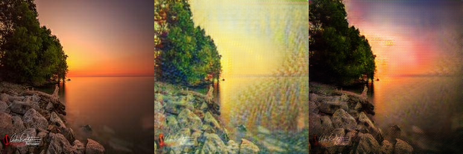
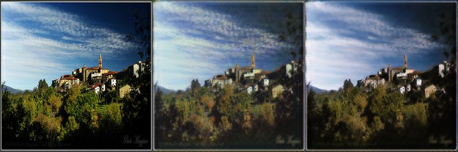
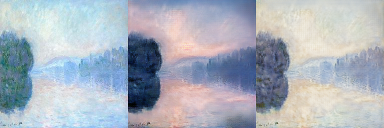

# Task 3 failure analysis - Yuyao Ding

This analysis uses checkpoint epoch 70 from `task3_formal_20260927T075834Z_d335ae80` and the fixed held-out test
panels in `evaluation_20260927T130841Z_a267de`. Every panel is input -> translation -> cycle from
left to right. A2B is Monet -> Photo; B2A is Photo -> Monet. These are qualitative
observations, not the independent two-rater audit and not a selection of submission images.

## Fixed cases

| Case | Observed limitation | Possible explanation or follow-up; not tested |
| --- | --- | --- |
| [011f46de73](outputs/task3_formal_20260927T075834Z_d335ae80/evaluation_20260927T130841Z_a267de/heldout_test/B2A_011f46de73_input_translation_cycle.png) (B2A) | The aircraft silhouette remains, but the sky becomes yellow/green with repeated fine vertical texture; small aircraft details are softened. | Broad texture and color matching may be easier than learning scene-dependent brushwork. Compare the same fixed panels when testing a single texture or loss change. |
| [018db0f253](outputs/task3_formal_20260927T075834Z_d335ae80/evaluation_20260927T130841Z_a267de/heldout_test/B2A_018db0f253_input_translation_cycle.png) (B2A) | Large bright regions become a flat yellow wash, reducing cloud shading and local contrast around the hills. | The model may overuse a bright palette for large sky regions. Check additional fixed bright-sky cases before changing identity weight. |
| [0212257854](outputs/task3_formal_20260927T075834Z_d335ae80/evaluation_20260927T130841Z_a267de/heldout_test/B2A_0212257854_input_translation_cycle.png) (B2A) | The rainbow and mountain layout survive, while fine trees and ridge detail become blurred and mottled. | Distribution matching and cycle reconstruction do not explicitly require local semantic detail. Inspect a fixed content slice rather than optimizing KID alone. |
| [022ca16b0f](outputs/task3_formal_20260927T075834Z_d335ae80/evaluation_20260927T130841Z_a267de/heldout_test/B2A_022ca16b0f_input_translation_cycle.png) (B2A) | The translation largely resembles a softened photograph; stylization is weaker than in the sunset and forest examples. | Style strength varies with scene content. A controlled identity-weight experiment could test the trade-off, but has not been run. |
| [02620a36f7](outputs/task3_formal_20260927T075834Z_d335ae80/evaluation_20260927T130841Z_a267de/heldout_test/B2A_02620a36f7_input_translation_cycle.png) (B2A) | The orange sunset shifts strongly toward pale yellow/green, and the smooth water acquires conspicuous repeated marks. | This may reflect a preferred palette and texture learned from the small Monet domain. Compare color drift and content preservation together. |
| [02b232fc78](outputs/task3_formal_20260927T075834Z_d335ae80/evaluation_20260927T130841Z_a267de/heldout_test/B2A_02b232fc78_input_translation_cycle.png) (B2A) | The waterfall and trees remain recognizable, but vegetation becomes uniformly mottled and the water gains repeated vertical marks. | Fine texture transfer may be excessive on already textured inputs. Any upsampling or loss ablation should keep the fixed evaluation set unchanged. |
| [0260d15306](outputs/task3_formal_20260927T075834Z_d335ae80/evaluation_20260927T130841Z_a267de/heldout_test/A2B_0260d15306_input_translation_cycle.png) (A2B) | The translated river gains darker tree shapes and a pink sky but still has diffuse, painted edges rather than clear photographic detail. | Unpaired translation cannot recover missing scene detail uniquely. More contrast should not be mistaken for photorealism. |
| [0bd913dbc7](outputs/task3_formal_20260927T075834Z_d335ae80/evaluation_20260927T130841Z_a267de/heldout_test/A2B_0bd913dbc7_input_translation_cycle.png) (A2B) | The field darkens and the sky changes color, while the broad painted cloud strokes remain visible. | The cycle objective can preserve source texture even when the target domain is photographic. This is a realism limitation, not a broken cycle constraint. |

## What the curves and metrics support

The model learned a repeatable translation and reconstruction, with no recorded
numerical failures. Test cycle L1 is 0.066813 for Monet and 0.061143 for Photo on
the [0,1] scale. Corresponding cycle LPIPS values are 0.292868 and 0.231483.
The reconstructed images often recover the original layout more clearly than the
translations do. Good reconstruction therefore does not establish convincing target style.

The two directions are asymmetric: Photo -> Monet has held-out generative precision
0.4333 and recall 0.8333, while Monet -> Photo has precision 0.9333 and recall 0.4333.
These small-sample feature-space estimates indicate a quality/diversity trade-off;
they should not be interpreted as human realism percentages. The photo domain is
broader than the 240-image Monet training set, which may contribute, but no causal
ablation establishes that explanation.

Relative to the quick baseline, held-out FID/KID and cycle reconstruction improve,
but Photo -> Monet coverage and MiFID do not. Some village details are less obscured
by texture in the current run, while the sunset palette problem remains. The result
is a measured improvement with visible limits, not uniformly better output.

Mean validation KID plateaus late and its best value occurs at epoch 70. Increasing
the epoch count alone is not supported as a sufficient fix. If another experiment is
needed after human review, change one factor at a time and select by validation;
keep the existing test set, audit cases and raw evidence fixed. Possible explanations
in the table are hypotheses, not results from experiments already performed.

## Pending human assessment

Two independent raters still need to complete the 30 fixed blind cases. Report mean
style/content/artifact-free scores and exact agreement/Cohen's kappa after both CSVs
are complete. Do not substitute the observations in this file for those scores.

Sources: [full results](results.md), [training curves](outputs/task3_formal_20260927T075834Z_d335ae80/training_curves.png),
[evaluation record](outputs/task3_formal_20260927T075834Z_d335ae80/evaluation_20260927T130841Z_a267de/evaluation.json), [audit instructions](outputs/task3_formal_20260927T075834Z_d335ae80/evaluation_20260927T130841Z_a267de/audit/instructions.md).
